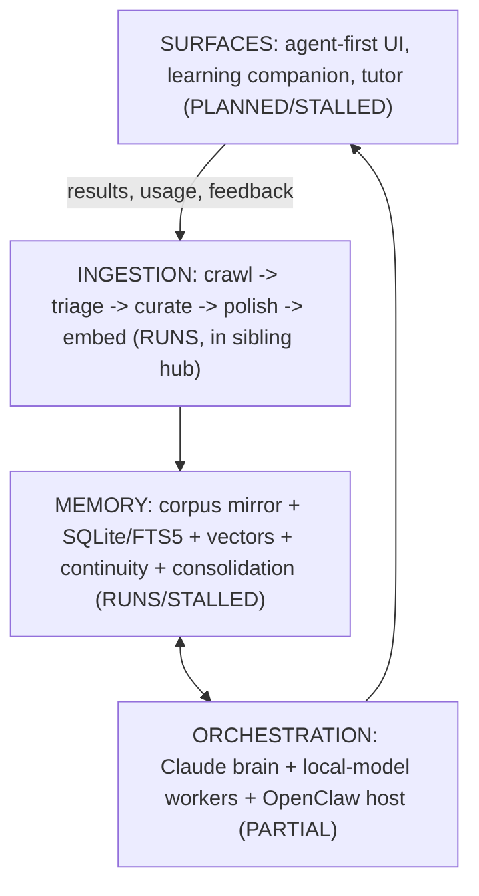

# Cortex

[](https://opensource.org/licenses/MIT)

A multi-agent orchestration system that takes content and results in, and responds by curating a totally agent-controlled memory: the brain. Built local-first by a single operator; part of Project Ava.

> **Honest status (2026-06-06):** this repo was `cheatSheets` (a personal learning system) through v7.8.1. An 18-month audit found elaborate architecture with no closed loops, and the project was re-founded as **Cortex** with the learning system demoted to one consumer surface. The full ontology, status-tagged so aspiration cannot masquerade as fact, lives in [`SPEC.md`](SPEC.md). The SPEC itself is an unvalidated hypothesis until Loop 1 closes ([`PLAN.md`](PLAN.md)).

## What this is



- **Ingestion** `RUNS`: a 6-stage human-gated pipeline (12 sources, ~680K chunks, hybrid vector+BM25+symbol retrieval) currently lives in the sibling Ava hub; porting it here is Loop 1 work
- **Memory** `RUNS substrate / STALLED curation`: markdown corpus mirror (human-auditable, Obsidian-friendly), SQLite + FTS5, ChromaDB vectors, and a continuity ledger. The consolidation layer (**Hippocampus**: sleep-phase promotion of memories) is built but starved
- **Orchestration** `PARTIAL`: premium model as the judging brain, local models as bulk workers behind MCP tools; zero new frameworks by decision
- **Surfaces** `PLANNED`: an agent-first UI + backend; the former cheatSheets learning companion revives when content exists

Every component in every document carries a status tag (`RUNS` / `STALLED` / `PLANNED` / `SPECULATIVE`). Present tense is permitted only for `RUNS`. That discipline is a survivor's rule: see the post-mortem notes in [`plans/archive/cortex-rebrand/`](plans/archive/cortex-rebrand/ARCHIVE_RECEIPT.md).

## Repo map

```
cortex (repo: cheatSheets)/
├── SPEC.md                    # Ontology + identity (single source of truth)
├── CLAUDE.md                  # Session rules + dev orchestration model
├── PLAN.md                    # Index of active work
├── plans/                     # Active plans (currently: Loop 1) + archive/
├── exploration/               # Ideas, research, resource landscape, idea-mines
├── architecture/              # Consolidated/completed work + retired docs (with receipts)
├── DECISIONS.md               # Curated architectural decision record
├── vault/                     # Obsidian vault (learning-companion surface, STALLED)
├── knowledge-agents/          # Agent identity packs (learning surface, not yet exercised)
├── archive/                   # Scoped: ELEGOO Mega 2560 reference kit
└── .ava/                      # Curriculum engine product files (runtime gitignored)
```

## Key documents

- [`SPEC.md`](SPEC.md): what Cortex is: memory model, layer ontology, entity catalog ordered by what actually exists, Loop 1 commitment
- [`exploration/resource-landscape.md`](exploration/resource-landscape.md): every technology considered, with ADOPT/TRIAL/DEFER/REJECT verdicts and named triggers
- [`PLAN.md`](PLAN.md): the active work index
- [`DECISIONS.md`](DECISIONS.md): why things are the way they are

## License

Released under the [MIT License](LICENSE).
