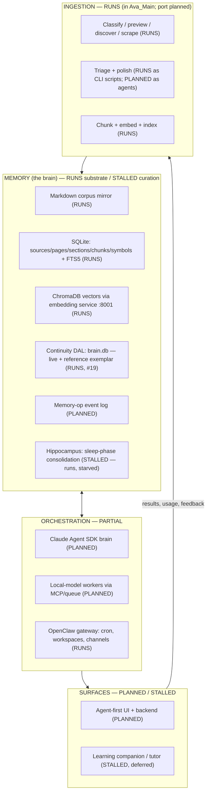

# Cortex

**Version:** 8.2.0-design | **Status:** Unvalidated until Loop 1 closes (§8) | **Created:** 2026-06-06 (Session 17) | **Supersedes:** see §10

A multi-agent orchestration system that takes content and results in, and responds by curating a totally agent-controlled memory: the brain. The learning companion ("cheatSheets", this repo's former identity) is the brain's first consumer surface, not the project.

This document owns the project's **ontology and identity**. Rules and session orchestration live in `CLAUDE.md`. Rationale for every technology verdict lives in `exploration/resource-landscape.md`; this SPEC does not repeat it.

---

## 1. Status vocabulary

The previous 18 months died of *specification mistaken for construction*: docs describing intended systems in the present tense until nobody could tell what existed. This SPEC is built so it cannot be misread that way.

| Tag | Meaning |
|---|---|
| `RUNS` | Verified working, with an artifact. Present-tense prose is permitted **only** for these |
| `STALLED` | Built, holds real data, no active loop |
| `PLANNED` | Decided and dated, not yet built |
| `SPECULATIVE` | Designed, zero instances. Parked until a named trigger fires |

Every component below carries a tag. A claim without a tag is a bug in this document.

## 2. The memory model

Cortex distinguishes **active/internal memory** (the local working state of a project or conversation) from the **long-term store** (consolidated, curated, durable). Content moves between them through a promotion lifecycle:

```
capture  ->  working memory  ->  long-term store
```

Two instances of this model exist today:

1. **The document lifecycle** `RUNS`: ideas and resources start in `exploration/`, become fully-defined active work in `plans/`, and consolidate into `architecture/` when their loop closes. `PLAN.md` indexes the active set. This repo operates on the model it builds.
2. **The content lifecycle** `PLANNED`: raw result -> importance-scored note -> linked, promoted memory. The consolidation engine is the **Hippocampus layer** (§3), driven by the existing sleep-phase dreaming machinery.

The store must always remain **human-auditable**: markdown mirrors and append-only logs beside the databases, readable in Obsidian and any editor.

The PE DAL (`brain.db`, decision #19) is the **working reference instance** of this model today: a live agent-curated continuity store whose human-readable exports are the repo's `.md` continuity files. Cortex's memory layer generalizes what the DAL prototypes.

## 3. Layer ontology



| Layer | Owns | Interface contract |
|---|---|---|
| **Ingestion** | Getting external content in: crawl, classify, human-gated curation, embedding | HTTP routes + (PLANNED) agent jobs |
| **Memory** | The brain: corpus, relational truth, vectors, continuity, the op log, consolidation | MCP tools (the `ava-docs` 7-tool server `RUNS` and is the template) |
| **Orchestration** | Which agent does what, with what model, under whose authority | Brain/worker split (§6); MCP as tool fabric |
| **Surfaces** | Humans and agents consuming the brain: UI, tutor, learning companion | AG-UI protocol (PLANNED, adopted when UI work starts) |

## 4. Entity catalog, ordered by what actually exists

Instance counts are from the 2026-06-06 audit. The ordering is the honesty mechanism: the proven chain leads.

### Tier 1: the load-bearing chain `RUNS`

| Entity | Instances | Where |
|---|---|---|
| Source | 12 | `doc_sources` + `~/.ava-corpus/sources/<slug>/source.json` |
| Page | ~180K | `doc_pages` + corpus `.md` files (frontmatter contract) |
| Section | ~550K | `doc_sections` (heading-anchored) |
| Chunk | ~680K | `doc_chunks` (500-token target, prev/next linked) |
| Symbol | ~150K | `doc_symbols` (cli_command/env_var/method/endpoint/config_key/error_code) |
| Embedding | ~410K | ChromaDB `avahub_docs` (page/section/chunk tiers) |
| IngestRun | ~300 | `doc_ingest_runs` (status, counts, errors) |
| TriageVerdict | per-source | `.triage/*.json` (keep/drop/unsure + confidence) |

### Tier 2: continuity `RUNS` — the only loop that ever closed, and the working memory exemplar

The DAL (`brain.db`) is live and canonical (decision #19, superseding the #17 freeze). It is also the **reference example** of agent-curated memory: the working instance of the model Cortex is designing. The repo `.md` files are curated exports of it.

| Entity | State | Where |
|---|---|---|
| Session / Decision / Note / Trace / Handoff | `RUNS` | `brain.db` DAL (canonical), via `dal.mjs` |
| Decisions (curated export) | `RUNS` | `DECISIONS.md` |
| Active work / next steps | `RUNS` | `PLAN.md` + `plans/loop-1-ingestion.md` checkboxes |
| Session narrative | `RUNS` | git history + `sessions/session-{N}.md` |

### Tier 3: planned spine `PLANNED` (0 instances)

| Entity | Purpose |
|---|---|
| MemoryOp | Append-only JSONL event log of every agent memory operation: the audit trail and replay spine |
| ImportanceScore | Write-time LLM-judged score routing memories to slow-decay vs fast-decay tiers |
| ConsolidationReport | Non-empty Hippocampus output (the dream-report files exist and run 3x daily but consolidate nothing: starved, not missing) |
| OntologyType (T-Box) | `ontology/cortex-ontology.yaml` + JSON Schema: the explicit type system agents validate against; diagrams generated from it |

### Tier 4: stalled learning-companion entities `STALLED`

Concept (6 rows / 4 notes), Curriculum (3), Lesson (60), Enrollment (2, idle since 2026-04). Engine code is sound and idempotent. Deferred until the learning-companion surface revives; trigger: first real course content authored.

### Tier 5: speculative `SPECULATIVE` (0 instances, parked)

Prerequisite edge (the wiki-link DAG), FSRS review loop, Course/Section/Lecture/Test hierarchy, and the 8 deferred entities of `Learning_Memory_Architecture_v0.1.md` (Pattern, Evidence Link, Extraction, ...). Each stays parked until a closed loop demands it.

## 5. Architecture direction (resolved 2026-06-06)

Full verdicts with rationale and named triggers: `exploration/resource-landscape.md`.

| Decision | Resolution |
|---|---|
| Ontology representation | Typed YAML T-Box + JSON Schema over the SQLite A-Box. **Mermaid is the design-phase default** (hand-authored, native GitHub/Obsidian rendering, zero infra, #20); **Graphviz/DOT deferred** to generated/data-dense views; Cytoscape later for interactive |
| Orchestration runtime | **Zero new frameworks.** OpenClaw (host) + Claude Agent SDK (brain) + local models as MCP-tool/subprocess workers + thin queue glue |
| Local inference | Ollama now + litellm router today; vLLM trialed when GPUs land; **GPU path: 2x used RTX 3090**, not R9700 |
| Memory substrate | Build the **policy**, keep the **substrate**: SQLite + ChromaDB + markdown mirror stay; event-sourced MemoryOp log added as the spine; idea-mines: A-MEM, SCM/FadeMem, Graphiti bitemporal |
| Azure touchpoint | One Foundry pay-per-call integration (Responses API + eval pass + Foundry Local hybrid toggle); cert target AI-103 |
| Isolation | The audit found nothing to sever: the hub provides no learning backend. Isolation = **building** Cortex's own thin backend (wraps the SDK loop, speaks MCP; AG-UI when UI starts), not separating from a working one |

## 6. Orchestration model (product layer)

- **Brain:** Claude (Agent SDK loop, self-hosted in our process). Spends premium tokens on judgment: orchestration, curation decisions, contradiction resolution, importance scoring review.
- **Workers:** local models (Ollama now; vLLM later) behind MCP tools or subprocess jobs. Spend GPU on bulk: triage, polish, embedding, summarization. Local models are never SDK subagents (SDK subagents are always Claude); they attach as tools.
- **Host:** OpenClaw gateway `RUNS`: scheduling, cron, workspaces, channels, dreaming.
- **Write authority:** agents write memory **only** through tool contracts that emit MemoryOp events. No direct DB writes from agents. Human gates stay at the curation step (the existing triage -> curate -> polish flow preserves them).
- **The dev-session working model** (sub-agent-driven development, verification gates, DAL rituals) is not this layer; it lives in `CLAUDE.md`.

## 7. Non-goals

- No new orchestration framework, and **no generic agent-builder** (the named 18-month killer)
- No OWL/DTDL/Neo4j-server/standing cloud spend; every Azure deferral has a named trigger
- No vector-store consolidation absent an empirical trigger (RAM ceiling or sync incident)
- No rebuilding commodity substrate (vector indexes, embedding models, storage engines)
- No content-scale promises. The retired END-GOAL's "100+ concepts, daily streak" target is gone; content targets return only attached to a running loop
- No new strategy documents while Loop 1 is open

## 8. Liveness discipline and Loop 1

**No layer is done until its loop closes once, end to end, with a verification artifact.** This rule exists because its absence is the documented cause of death of this project's first life.

**Loop 1 (binding commitment, next build session):**

1. Run the never-verified ingestion cycle end-to-end against one real source: triage -> curate -> polish -> embed (the Azure AI Foundry docs serve the career thread simultaneously)
2. Agentify triage + polish onto the brain/worker split (Claude judges, local model labors), emitting MemoryOp events with importance scores
3. Feed the scored writes to the dreaming machinery and produce **the first non-empty Hippocampus consolidation report**

Artifacts: ingest-run record, MemoryOp log segment, one consolidation report with promoted content. **Until Loop 1 closes, this SPEC is an unvalidated hypothesis, and the next session's job is closing it, not writing more documents.**

## 9. Naming & homes

**Cortex** is the project and the brain. Chosen for goal-accuracy over collision-avoidance; a public-facing name can be minted later if needed. **Hippocampus** is reserved for the consolidation layer. `cheatSheets` survives as the learning-companion surface's name.

**Design/build split (decisions #18, #21):** this repo is the **design home**, renaming to `cortex-design` (`exploration/cortex-design-rename.md`, executed at a session boundary). It also **houses the stalled learning-system** content (`vault/`, `knowledge-agents/`, `archive/`, `.ava/learning*`) until that surface revives. `/home/ava/cortex` is the **build home / first deployable target**, intentionally empty until the design phase yields a buildable Loop 1 charter.

**Topology: two folders now, three-target end-state documented.** `cortex-design` (design + stalled learning-system) + `cortex` (deployable target). The learning-system spins out to its own target only at its revival trigger (first real course content). Building an empty third folder now is the build-ahead-of-need pattern being avoided.

The current phase is DESIGN: research, brainstorming, visualization (**Mermaid-first**, Graphviz deferred — #20), language/ontology definition. The repo's claim matches its contents: it is the design.

## 10. Supersessions

This SPEC retires the following (extraction receipts accompany each move):

| Document | Fate |
|---|---|
| `END-GOAL.md` | Retired -> `architecture/` with receipt; north-star role absorbed by §Identity here |
| `plans/learning-system.md` | Archived; durable value: the substrate inventory (absorbed by audit + §4) |
| `plans/edx-courses.md` | Archived; phases become named triggers on Tier 4 revival |
| `plans/resilience.md` | Archived; its unfixed hang-bug finding becomes an open issue |
| `Learning_Memory_Architecture_v0.1.md` | Moved to `exploration/` as an idea-mine; its 14-entity model feeds Tier 5 triggers |
| `memory_system_expansion.md` | Moved to `exploration/` as an idea-mine for the Hippocampus layer |
| `Cheatsheet_Generation_Prompt.md` | Archived; contradicts current authoring rules |
| `CLAUDE.md` (old architecture sections) | Rewritten: rules + session orchestration + pointer here |

## 11. Open questions

| Question | Decide by |
|---|---|
| Port the Ava_Main ingestion libs into this repo vs wrap as a service | Loop 1 planning (the reuse matrix in `exploration/resource-landscape.md` §1 favors porting the portable four) |
| Tutor consolidation: `knowledge-agents/tutor/` identity pack vs root `tutor/` OpenClaw workspace - merge into one | Deferred to Loop 2 (Session 17); both kept meanwhile |
| UI stack for the agent-first frontend (AG-UI + which renderer) | When UI work starts (after Loop 1) |
| GPU purchase timing (2x 3090) | Kaden; unblocks worker parallelism but Loop 1 runs on the 3070 |
| ~~Public-facing name, repo rename timing~~ | Resolved 2026-06-06: `cortex-design` design home + empty `/home/ava/cortex` build home (decision #18) |
| Ingest-layer format contract details (frontmatter requirements per doc type, diagram doc-type, MemoryOp schema overlap) | Design phase, via `LANGUAGE.md` open questions |
