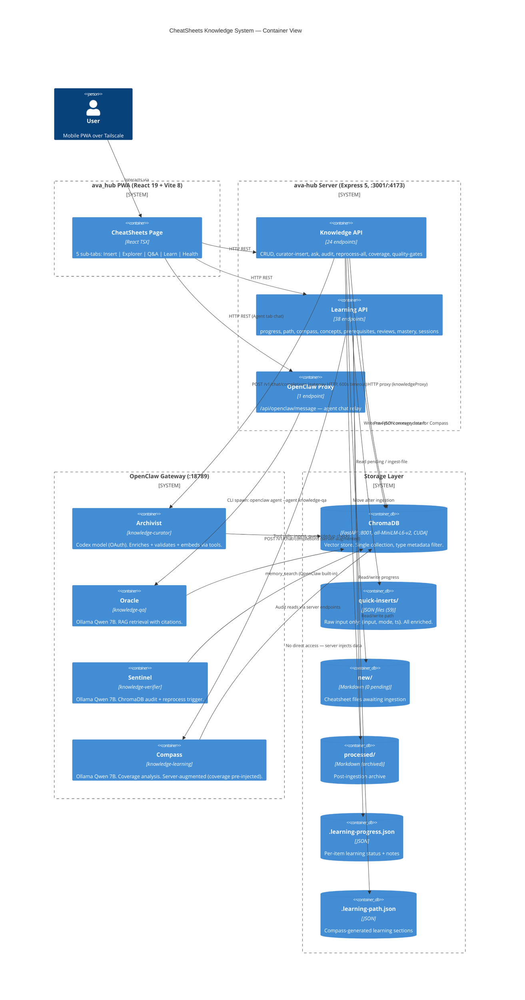
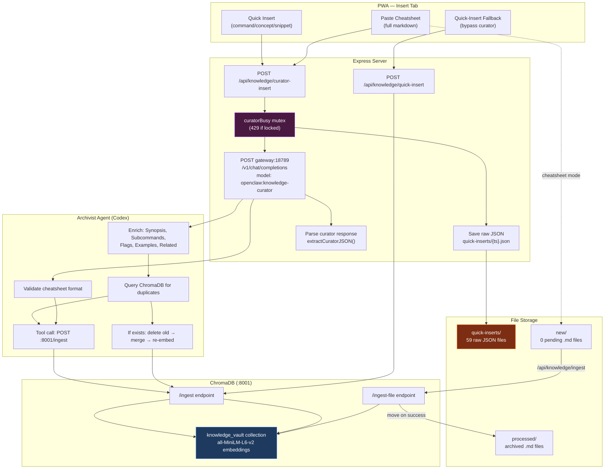
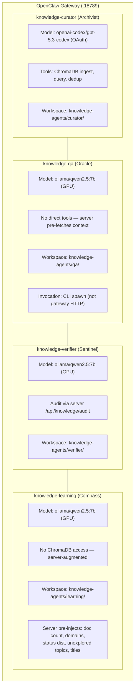
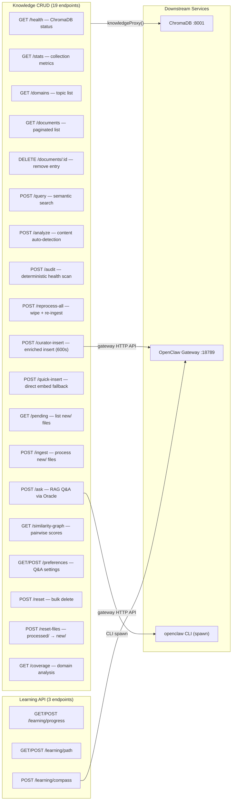
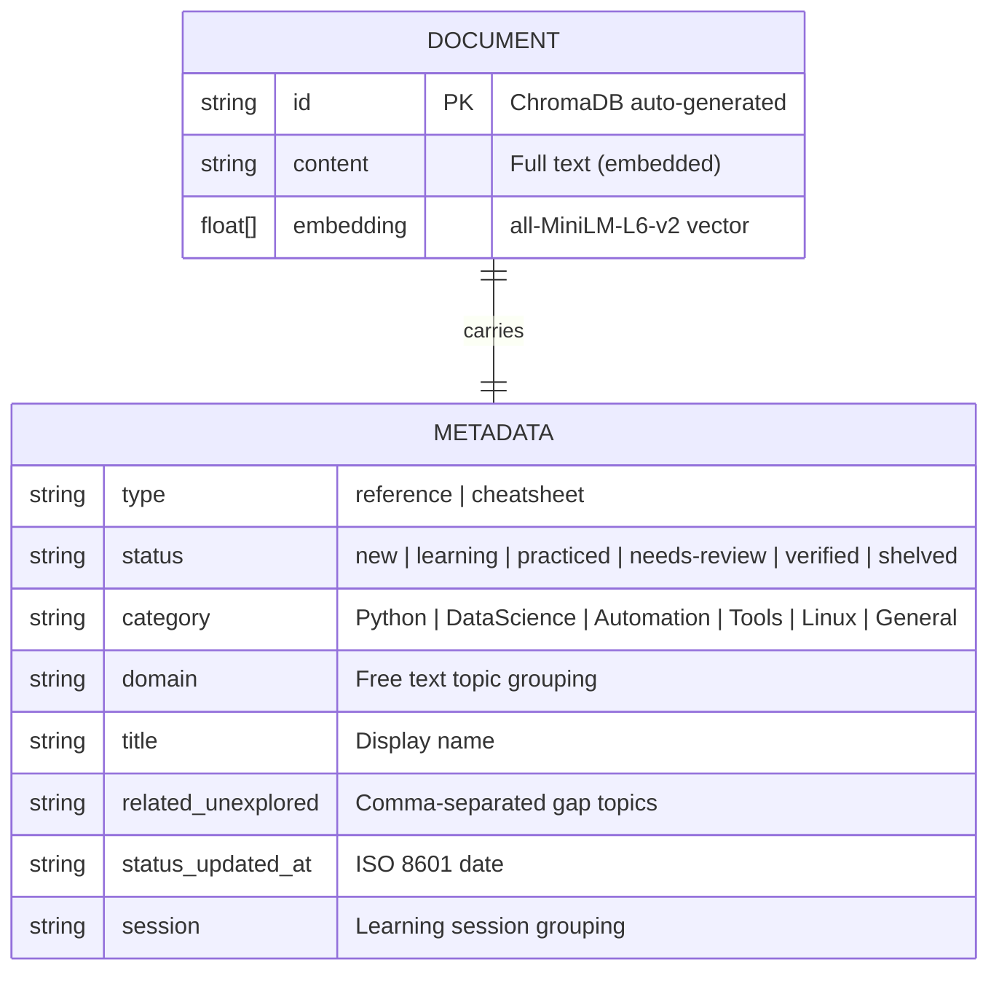

# CheatSheets Knowledge System — Architecture

> **Note (2026-03-18):** Stale — agent models listed as Ollama Qwen 7B are incorrect (all Codex via OpenClaw gateway since Session 75). Architecture is being redesigned per session-based model in `documentation/plans/knowledge-learning-plan.md`. This file will be rewritten.

**Version:** 4.2 | **Generated:** 2026-03-11

---

## 1. C4 Container Diagram

---

## 2. Data Flow — Insert Paths

---

## 3. Data Flow — Retrieval Paths

```mermaid
flowchart TB
    subgraph UI["PWA Sub-Tabs"]
        EXP["Explorer Tab"]
        QA_TAB["Q&A Tab"]
        LEARN["Learn Tab<br/>(Overview panel)"]
        HEALTH["Health Tab"]
    end

    subgraph Server["Express Server"]
        DOCS_EP["GET /api/knowledge/documents"]
        SIM_EP["GET /api/knowledge/similarity-graph"]
        ASK_EP["POST /api/knowledge/ask"]
        QUERY_EP["POST /api/knowledge/query"]
        STATS_EP["GET /api/knowledge/stats"]
        DOMAINS_EP["GET /api/knowledge/domains"]
        COV_EP["GET /api/knowledge/coverage"]
        AUDIT_EP["POST /api/knowledge/audit"]
        REPROC_EP["POST /api/knowledge/reprocess-all"]
        COMPASS_EP["POST /api/learning/compass"]
    end

    subgraph Agents["OpenClaw Agents"]
        ORACLE["Oracle (knowledge-qa)<br/>CLI spawn, Ollama 7B"]
        SENTINEL["Sentinel (knowledge-verifier)<br/>Ollama 7B"]
        COMPASS_A["Compass (knowledge-learning)<br/>Ollama 7B"]
    end

    subgraph ChromaDB["ChromaDB (:8001)"]
        QUERY_C["/query — semantic search"]
        DOCS_C["/documents — list all"]
        STATS_C["/stats — collection metrics"]
        SIM_C["/similarity-graph — pairwise"]
        RESET_C["/reset — bulk delete"]
    end

    EXP --> DOCS_EP --> DOCS_C
    EXP --> SIM_EP --> SIM_C

    QA_TAB --> ASK_EP
    ASK_EP -->|"1. Retrieve context"| QUERY_C
    ASK_EP -->|"2. Build RAG prompt"| ORACLE
    ORACLE -->|"Answer with citations"| QA_TAB

    LEARN --> COV_EP --> STATS_C & DOCS_C
    LEARN --> COMPASS_EP
    COMPASS_EP -->|"Pre-fetch coverage"| STATS_C & DOCS_C
    COMPASS_EP -->|"Augmented message"| COMPASS_A

    HEALTH --> AUDIT_EP -->|"Scan all docs"| DOCS_C
    HEALTH --> REPROC_EP -->|"1. Wipe"| RESET_C
    REPROC_EP -->|"2. Move processed/ → new/"| FILES_MOVE["File ops"]
    REPROC_EP -->|"3. Re-ingest .md"| INGEST_FILE["/ingest-file"]
    REPROC_EP -->|"4. Re-ingest quick JSON"| INGEST["/ingest"]

    style ORACLE fill:#1a472a,stroke:#22c55e,color:#fff
    style COMPASS_A fill:#1a472a,stroke:#22c55e,color:#fff
    style SENTINEL fill:#1a472a,stroke:#22c55e,color:#fff
```

---

## 4. Agent Architecture

---

## 5. UI Tab Structure

```mermaid
flowchart TB
    CS["CheatSheets Page (v3.4, amber accent)"]

    CS --> INS["Insert Tab"]
    CS --> EXP["Explorer Tab"]
    CS --> QAT["Q&A Tab"]
    CS --> AGT["Agent Tab"]
    CS --> LRN["Learn Tab"]
    CS --> HLT["Health Tab"]

    INS -->|"Quick Insert"| QI_F["command/concept → curator-insert"]
    INS -->|"Paste Cheatsheet"| CS_F["markdown → curator-insert (cheatsheet mode)"]
    INS -->|"Direct Embed"| DE_F["quick-insert (bypasses curator)"]

    EXP --> DOCS["Document list + search"]
    EXP --> SIM["Similarity graph visualization"]

    QAT --> RAG["RAG query → Oracle agent → cited answer"]

    AGT --> CHAT["OpenClaw agent chat (any agent)"]
    AGT --> IDENT["Agent identity panels (4 agents)"]

    LRN --> OV["Overview"]
    LRN --> ML["ML Demos"]
    LRN --> LLM["LLM Demos"]
    LRN --> LP["Learning Path"]

    OV --> COV["Coverage dashboard (domains, categories, gaps)"]
    OV --> COMP["Compass agent chat (server-augmented)"]

    LP --> DYN["Dynamic path from .learning-path.json"]
    LP --> PROG["Per-item progress tracking (.learning-progress.json)"]

    HLT --> AUD["Audit (deterministic scan)"]
    HLT --> REPR["Reprocess All (wipe + re-ingest, requires confirmation)"]
    HLT --> SENT["Sentinel agent identity"]
```

---

## 6. Server Endpoint Map

---

## 7. ChromaDB Metadata Schema

**Current state:** 55 documents total. Retention cycle (shelved -> needs-review -> verified) via FSRS engine.

---

## 8. Known Issues and Architectural Notes

```mermaid
flowchart TB
    subgraph Issues["Known Issues"]
        direction TB
        I1["quick-inserts/ stores only raw input<br/>{input, mode, ts} — no curator output<br/>→ reprocess-all falls back to raw input,<br/>losing enrichment (lossy reprocessing)"]
        I2["OpenClaw memory_search quota exhausted<br/>→ Compass cannot query ChromaDB directly<br/>→ Server pre-fetches coverage data<br/>and injects into prompt"]
        I3["related_unexplored references<br/>May have stale entries after<br/>knowledge base growth"]
        I4["55 docs total<br/>Status lifecycle never exercised<br/>(no verified, no needs-review)"]
        I5["Curator mutex: curatorBusy flag<br/>Only 1 concurrent insert<br/>(429 if busy, no queue)"]
    end

    subgraph Notes["Architecture Notes"]
        direction TB
        N1["Single ChromaDB collection<br/>type metadata filters reference vs cheatsheet"]
        N2["Oracle invoked via CLI spawn<br/>(not gateway HTTP — legacy path)"]
        N3["Compass is server-augmented:<br/>coverage data pre-injected into prompt<br/>so 7B model needs no tool access"]
        N4["Gateway HTTP requires OPENCLAW_GATEWAY_TOKEN<br/>env var set in systemd service"]
    end
```

