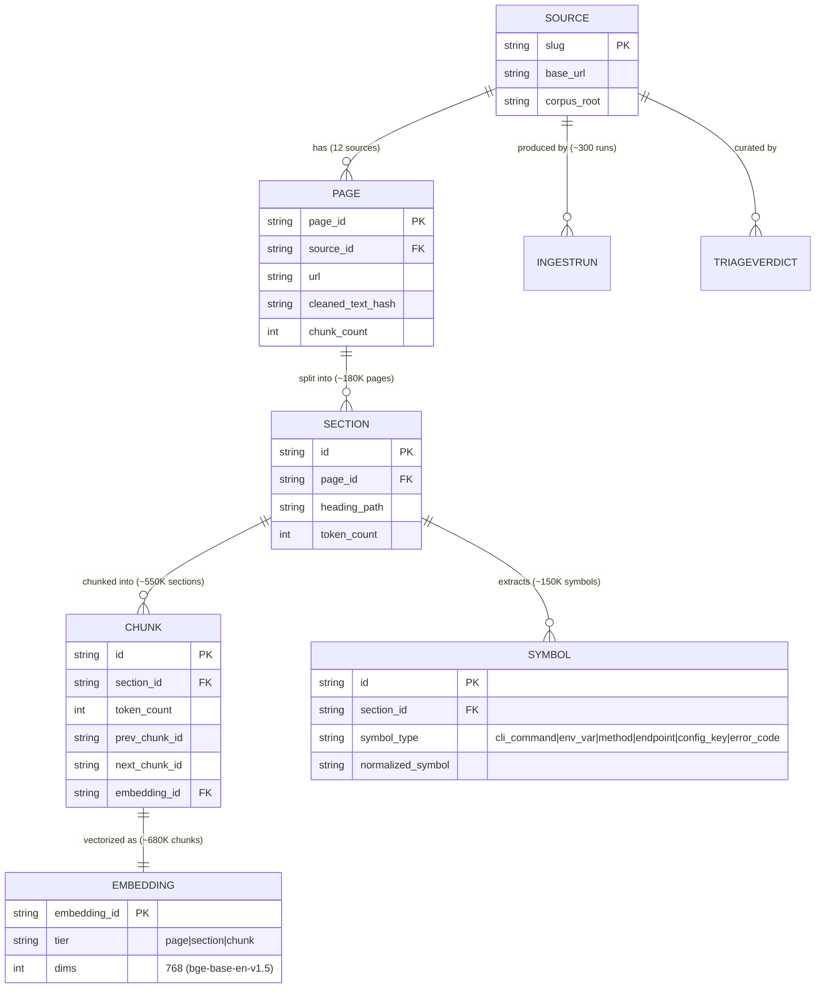

# Entity Catalog — Mermaid ER (SPEC §4)

**Status:** design artifact, Mermaid (decision #20) | renders natively on GitHub + Obsidian, no infra

The load-bearing Tier 1 chain (`RUNS`, real instance counts from the 2026-06-06 audit) as an entity-relationship diagram. This is the proof that Mermaid covers the ER + flowchart needs of the design phase; the equivalent Graphviz version (`cortex-layers.dot`) is kept only as the deferred-tooling reference.

Tiers 2-5 (continuity, planned spine, stalled learning entities, speculative) are catalogued in `SPEC.md` §4; they get their own diagrams when their loops warrant.
