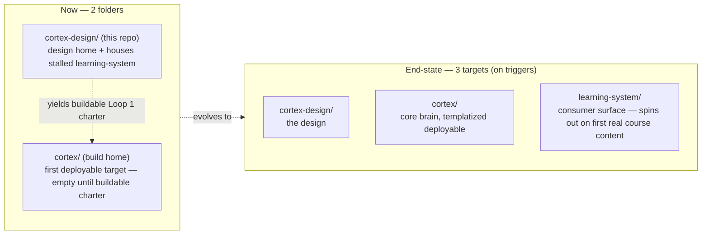

# Project Topology & Cleanup

**Created:** 2026-06-08 | **Status:** Exploration (intended state + tracked cleanup) | Refs: decisions #18, #21

How the project's folders, surfaces, and continuity are organized, and what cleanup is pending. This is the map; `SPEC.md` is the ontology.

## Folder topology (decision #21)

Two folders now. Three-target end-state documented, built on triggers.

| Folder | Role | State |
|---|---|---|
| `cortex-design/` (now `cheatSheets/`) | Design home; also houses the stalled learning-system (`vault/`, `knowledge-agents/`, `archive/`, `.ava/learning*`) | `RUNS` (design phase) |
| `cortex/` | Build home / first deployable, templatized, project-scoped consumer surface | `PLANNED` — intentionally empty until a buildable charter |
| `learning-system/` | A second consumer-surface target | `SPECULATIVE` — created only at revival trigger (first real course content) |

## Surfaces inside cortex-design today

| Surface | What | Status |
|---|---|---|
| Design corpus | `SPEC.md`, `CLAUDE.md`, `PLAN.md`, `LANGUAGE.md`, `DECISIONS.md`, `exploration/`, `architecture/` | `RUNS` |
| Continuity (the working memory exemplar) | `.ava/` DAL (brain.db) — live + canonical (#19); `.md` files are curated exports | `RUNS` |
| Stalled learning-system | `vault/` (4 concepts), `knowledge-agents/` (10 mostly-empty agent dirs), `archive/elegoo-mega-kit/` (45MB), `.ava/learning*.mjs` + `learning.db`, `vault/Courses/` (ColumbiaX scaffold) | `STALLED` (SPEC §4 Tier 4) |
| OpenClaw `tutor/` runtime | Gitignored workspace; dream cron | `STALLED`, consolidation deferred to Loop 2 |

## Pending cleanup (tracked, not urgent)

| Item | Action | When |
|---|---|---|
| Learning surface is scattered across the root | Group `vault/`+`knowledge-agents/`+`archive/`+learning `.ava/` files under a clear learning-system boundary | At learning-system spinout (touches `learning.db` path refs; do as one migration) |
| `archive/` 45MB (40MB ELEGOO PDF) | Lives under the learning surface grouping; `root_archive_present` warning is a known scoped exception | With the grouping above |
| Two `tutor/` definitions | Retire root `tutor/` or merge `knowledge-agents/tutor/` identity into it | Loop 2 |
| `exploration/research/` uneven nesting | `graphviz/` nested, `orchestration.md` flat — normalize | When convenient |
| `cheatSheets` -> `cortex-design` rename | `exploration/cortex-design-rename.md` | Session boundary (next), Kaden-executed |

## Continuity & PM surfaces

- **brain.db DAL** (`.ava/`): live continuity + the working agent-curated-memory exemplar (#19). Canonical.
- **Repo `.md`** (`DECISIONS.md`, `PLAN.md`): curated exports of the DAL, refreshed at milestones.
- **GitHub** (Issues, Projects): public collaboration + checklist surface.
- **Linear**: available, **DEFER** — adopt when there's multi-stream build work to track that `PLAN.md` + plan checkboxes can't hold (post-Loop-1). Until then it's another surface to sync (drift risk); the single active plan doesn't warrant it.
