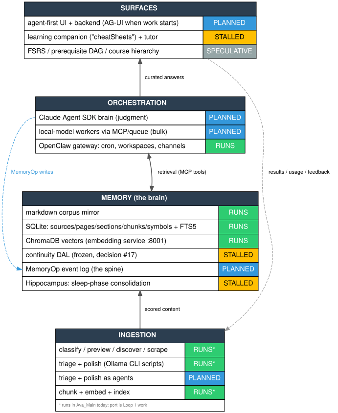

# Graphviz — Cortex Design-Language Expertise

**Created:** 2026-06-06 (Session 17) | **Status:** Adopted design-phase visualization language (landscape §2b: TRIAL -> validated, see proof below) | **Local engine:** dot 2.43.0 (apt-era; fine for the core loop, see toolchain note)

Graphviz DOT is Cortex's design-phase visualization language: machine-readable, agent-generatable, and capable of rendering data (schemas, status, fields) *inside* nodes, which Mermaid cannot. Every claim in the four references below was verified against graphviz.org primary sources, and every code example compiled on this box's `dot` 2.43.0.

## The references

| File | Covers |
|---|---|
| [`graphviz/language.md`](graphviz/language.md) | DOT grammar, the ~20 attributes that matter, record-vs-HTML decision rule, rank/edge idioms, verified gotchas |
| [`graphviz/html-labels.md`](graphviz/html-labels.md) | The XML-strict subset, TABLE/TD reference, **row-level PORT anchoring** (the killer feature), compiled worked examples, emitter escaping rules |
| [`graphviz/layouts.md`](graphviz/layouts.md) | Engine selection (dot/sfdp/osage mapped to Cortex cases), large-graph survival guide, output formats, CLI toolkit (gvpr/unflatten/ccomps) |
| [`graphviz/toolchain.md`](graphviz/toolchain.md) | Ubuntu version reality, Obsidian verdict (committed-SVG canonical, no live plugin), Git workflow recipes, emitter libraries, interactive future path |

## Operating decisions (binding for design artifacts)

1. **Committed-SVG is canonical.** GitHub doesn't render DOT; no maintained Obsidian DOT plugin exists. Render locally (`make diagrams`), commit `.dot` + `.svg` together; never hand-edit renders.
2. **Engine mapping:** layer/architecture views -> `dot`; generated ontology graphs (hundreds+ nodes from data) -> `sfdp -Goverlap=prism`; cluster summaries -> `osage`.
3. **Status palette (SPEC §1 made visual):** RUNS `#2ECC71` · STALLED `#FFBF00` · PLANNED `#3498DB` · SPECULATIVE `#95A5A6`. Header bars `#2C3E50`.
4. **Emitter default:** Python `graphviz` v0.21 when diagrams start generating from YAML/SQLite; `ts-graphviz` for a future JS UI; raw templating only for trivial shapes.
5. **Every node gets an `href`** pointing at its canonical doc/anchor once diagrams stabilize: clickable SVG with zero JS.
6. **CI staleness gate** when CI exists: `make diagrams && git diff --exit-code` with a pinned Graphviz version.

## First artifact (proof of toolchain)

[`../design/cortex-layers.dot`](../design/cortex-layers.dot) -> rendered [`cortex-layers.svg`](../design/cortex-layers.svg): the SPEC §3 layer ontology as status-carded HTML-label nodes, including a row-level port edge (`orchestration:brain -> memory:memop`) expressing the write-authority rule visually. Compiled and visually verified 2026-06-06.

