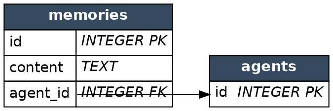
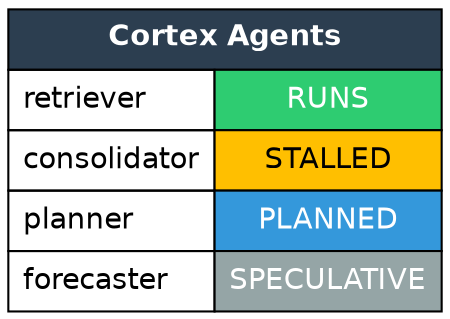

# Graphviz HTML-Like Labels Reference

**Cluster:** data-dense nodes | **Verified:** 2026-06-06 — all worked examples compiled with local `dot` 2.43.0 (exit 0); error cases empirically triggered | Source: [shapes.html#html](https://graphviz.org/doc/info/shapes.html#html), [portPos](https://graphviz.org/docs/attr-types/portPos/)

## The Supported Subset (exact, with unsupported pitfalls)

HTML-like labels are an **XML-strict subset**, not HTML. The whole label is wrapped in **angle brackets** `label=<...>`, never quotes (quotes silently render the markup as literal text — no error, wrong output).

Exact grammar (verbatim from the spec):
```
text     := string | <BR/> | <FONT>text</FONT> | <I> | <B> | <U> | <O> | <SUB> | <SUP> | <S>
table    := <TABLE>rows</TABLE>
rows     := row | rows row | rows <HR/> row          (HR only BETWEEN rows)
row      := <TR>cells</TR>
cells    := cell | cells cell | cells <VR/> cell      (VR only BETWEEN cells)
cell     := <TD>label</TD> | <TD></TD>          (IMG only inside a TD)
```

**Supported tags:** `TABLE TR TD` (structure); `FONT BR` (text layout); `B I U O S SUB SUP` (styling; `O`=overline); `HR VR` (rules); `IMG`.

**NOT supported (hard pitfalls):**
- No CSS, no class/stylesheet, no `<div>/<span>/<p>/<ul>/<a>` — anything outside the grammar is a syntax error
- `HR`/`VR`/`BR`/`IMG` must be **self-closing** (`<BR/>`). `<BR>` → `Error: syntax error` (verified)
- Attribute values **must be double-quoted**. `BORDER=1` → `Error: not well-formed (invalid token)` (verified)
- `HR` illegal inside `<TR>`; `VR` illegal inside `<TD>`; `IMG` illegal outside a `<TD>`
- Whitespace outside `<TD>` is ignored — indent freely

## TABLE/TD Attribute Reference

**`<TABLE>`**: `ALIGN BGCOLOR BORDER CELLBORDER CELLPADDING CELLSPACING COLOR COLUMNS FIXEDSIZE GRADIENTANGLE HEIGHT HREF ID PORT ROWS SIDES STYLE TARGET TITLE TOOLTIP VALIGN WIDTH`

| Attr | Values / meaning |
|------|------|
| `BORDER` | outer frame px (0 = none) |
| `CELLBORDER` | per-cell border px (set once on TABLE, inherited) |
| `CELLSPACING` / `CELLPADDING` | gap between cells / space inside cells (px) |
| `BGCOLOR` | X11/SVG name or `#RRGGBB`; `c1:c2` = gradient |
| `ALIGN` / `VALIGN` | `CENTER\|LEFT\|RIGHT` / `MIDDLE\|BOTTOM\|TOP` |
| `FIXEDSIZE` + `WIDTH`/`HEIGHT` | exact sizing |
| `COLUMNS`/`ROWS` | `"*"` draws rules between all cols/rows |
| `SIDES` | which border edges draw, e.g. `"LT"` |
| `PORT` | portname for the whole table |

**`<TD>`** adds: `COLSPAN`/`ROWSPAN` (1-65535), `PORT` (edge anchor), `BALIGN` (default align for child `<BR/>`), per-cell `BGCOLOR` (how you color-code status).

**`<FONT COLOR FACE POINT-SIZE>`** · **``** (`SCALE=FALSE|TRUE|WIDTH|HEIGHT|BOTH`) · **`<BR ALIGN>`**.

## Ports: Row-Level Edge Anchoring

`PORT="name"` on a `<TD>` makes that cell an edge endpoint — the killer feature: an edge targets **one row** of a schema table, not the whole node. Endpoint syntax: `node:port` or `node:port:compass` (compass: `n ne e se s sw w nw c _`). Port names unique per node. Unlike record ports, HTML ports coexist with full table formatting.

## Worked Examples (compiled on dot 2.43.0)

Use `shape=none, margin=0` so the table IS the node.

**(a) Entity table with typed fields + port-anchored FK edge:**


**(b) Status-tagged architecture card** (the Cortex pattern; note `amber` is NOT a valid color name — use `#FFBF00`):


**(c) Nested tables (record-of-records comparison):** a TD whose label is itself a TABLE — see the compiled example in this cluster's transcript; pattern: outer `TABLE BORDER="1" CELLBORDER="0"` with TDs each containing an inner `TABLE BORDER="0" CELLBORDER="1"`.

## Generation & Escaping Rules

When emitting labels from YAML/JSON/SQLite, escape in this order (`&` first, always):

| Char | In text | In attr value |
|------|---------|---------------|
| `&` | `&amp;` | `&amp;` |
| `<` | `&lt;` | `&lt;` |
| `>` | `&gt;` | `&gt;` |
| `"` | (ok bare) | `&quot;` |

The spec lists exactly these four; anything else can go through as numeric entity `&#NN;`.

**Generator checklist (each maps to a verified error/symptom):**
- Whole label in `<...>`, not `"..."` — quotes silently render literal text
- Quote every attribute value — else `not well-formed (invalid token)`
- Self-close voids `<BR/> <HR/> <VR/> ` — else `syntax error`
- Balance every tag; one PORT name per node; every port referenced by an edge must exist
- Map status enums to a fixed hex palette (no invented color names; `amber` → `Warning: ... not a known color` + fallback)
- Convert user newlines inside cells to `<BR/>`; raw whitespace between tags is harmless
