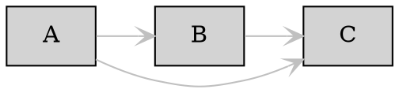
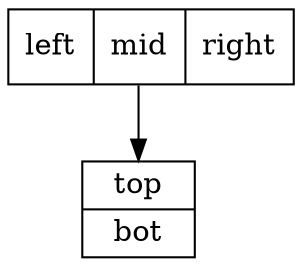
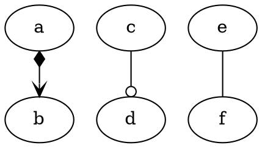
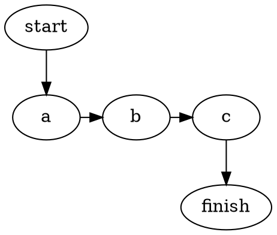

# Graphviz DOT Language Reference

**Cluster:** language fundamentals | **Verified:** 2026-06-06 against local `dot` 2.43.0 (18 snippets through `-Tcanon`, all PASS) | Sources: graphviz.org, cited inline

## Grammar Essentials

Full EBNF: [lang.html](https://graphviz.org/doc/info/lang.html). Core productions:

```
graph     : [ strict ] (graph | digraph) [ ID ] '{' stmt_list '}'
stmt      : node_stmt | edge_stmt | attr_stmt | ID '=' ID | subgraph
attr_stmt : (graph | node | edge) attr_list          // sets defaults for that scope
edge_stmt : (node_id | subgraph) edgeRHS [ attr_list ]
edgeRHS   : edgeop (node_id | subgraph) [ edgeRHS ]
port      : ':' ID [ ':' compass_pt ] | ':' compass_pt
```

- **`graph` vs `digraph`**: undirected vs directed. `edgeop` is `--` in `graph`, `->` in `digraph`. Wrong operator for the graph type is a parse error; you cannot mix them.
- **`strict`**: collapses multi-edges (and self-loops) between the same pair into one. Use for ontologies where parallel edges are never wanted.
- **Defaults inheritance**: `node [shape=box]`, `edge [color=gray]`, `graph [bgcolor=white]` set defaults for all *subsequently declared* objects in the current subgraph scope. Children inherit; later same-scope redeclarations override. Defaults set before a node's first mention apply; set after, they don't.



- **IDs**: (a) `[a-zA-Z_][a-zA-Z_0-9]*`, (b) a numeral, (c) a `"double-quoted string"`, or (d) an `<HTML string>`. Quote any ID with spaces, punctuation, or keyword collisions (`graph`, `digraph`, `node`, `edge`, `subgraph`, `strict`).
- **Escaping**: inside `"..."`, `\"` is a literal quote; trailing `\` continues the line. `+` concatenates string IDs: `label="part1 " + "part2"` (verified).
- **Comments**: `// line`, `/* block */`, `#` preprocessor lines (discarded).
- **Statements**: `;` optional; newline terminates. `a->b a->c` parses fine.
- **Subgraph as endpoint**: `a -> {b c d}` fans out; `{x y} -> z` fans in.

## Attributes That Matter

~170 attributes exist ([attrs](https://graphviz.org/doc/info/attrs.html); Used-By codes: **G**raph **N**ode **E**dge **C**luster **S**ubgraph). The working set:

### Graph / layout (G, C)

| Attr | Default | What it does |
|------|---------|--------------|
| `rankdir` | `TB` | Layout direction: `TB` `LR` `BT` `RL` |
| `ranksep` | `0.5` | Inches between ranks |
| `nodesep` | `0.25` | Min inches between same-rank nodes |
| `splines` | `""` | Edge routing: `ortho`, `polyline`, `curved`, `line`/`false`; empty = spline in dot |
| `bgcolor` | none | Canvas/cluster background |
| `concentrate` | `false` | Merge parallel edge segments |
| `ordering` | `""` | `out`/`in`: preserve edge declaration order |
| `label` | `""` | Graph title / cluster box label |
| `style` | `""` | Cluster: `filled`, `rounded`, `dashed`, `invis` |

### Node (N)

| Attr | Default | What it does |
|------|---------|--------------|
| `shape` | `ellipse` | See Shapes |
| `label` | `"\N"` | `\N`=node name; `\n`/`\l`/`\r` = center/left/right newline |
| `style` | `""` | `filled`, `rounded`, `dashed`, `dotted`, `bold`, `invis` (comma-list) |
| `fillcolor` | `lightgrey` | Fill (requires `style=filled`) |
| `color` | `black` | Border color |
| `penwidth` | `1.0` | Border thickness (pt) |
| `peripheries` | shape-dep | Extra outline rings |
| `width`/`height` | `0.75`/`0.5` | Min size (inches) |
| `fontname`/`fontsize` | `Times-Roman`/`14` | Set a `node []` default once |

### Edge (E)

| Attr | Default | What it does |
|------|---------|--------------|
| `label` | `""` | Also `xlabel`, `headlabel`, `taillabel` |
| `dir` | `forward` | `forward` `back` `both` `none` |
| `arrowhead`/`arrowtail` | `normal` | See Edge Control |
| `constraint` | `true` | `false` = drawn but ignored for ranking |
| `weight` | `1` | Higher = straighter/shorter |
| `style` | `""` | `dashed`, `dotted`, `bold`, `invis` |
| `color` | `black` | `c1:c2` draws parallel lines |
| `headport`/`tailport` | center | Attachment (compass or record port) |

## Shapes & Labels

Catalog: [shapes.html](https://graphviz.org/doc/info/shapes.html).

- **Polygon shapes**: `box`/`rect`, `square`, `ellipse`, `circle`, `doublecircle`, `point`, `triangle`, `diamond`, `Mdiamond`, `Msquare`, `trapezium`, `parallelogram`, `house`, `pentagon`..`octagon`, `star`, `cylinder` (DBs), `note`, `tab`, `folder`, `component`, `box3d`, `plaintext`/`none`, `plain`, `underline`.
- **Record shapes** (`record`, `Mrecord`=rounded): `|` separates fields; `{...}` flips orientation per nesting; `<name>` declares a port.



**Decision rule** (per the shapes doc): records are "largely superseded" by HTML labels. **Records** for quick flat field rows with ports (terse). **HTML labels** for per-cell styling, colspan/rowspan, images, true tables: anything resembling a typed entity card. See `html-labels.md`.

**Gotcha (verified):** HTML in a quoted string is literal text. `label="<b>x</b>"` prints `<b>x</b>`. Markup requires `label=<...>` angle-bracket delimiters.

## Edge & Rank Control Idioms

Arrows: [arrows.html](https://graphviz.org/doc/info/arrows.html). Primitives: `normal box crow curve icurve diamond dot inv none tee vee`. Modifiers: `o`=open, `l`/`r`=clip. Stack up to 4 (first = nearest node).



**Ports + compass**: `:port:compass`, compass in `n ne e se s sw w nw c _`. `a:e -> b:w`, or `[tailport=s, headport=n]`.

**Rank pinning**:


**Invisible scaffolding**: `style=invis` nodes/edges nudge layout without drawing. **weight** straightens a spine; **constraint=false** draws without distorting ranks (back-references/cross-links).

## Gotchas (all verified on 2.43.0)

- **Cluster name must start with `cluster`**: `subgraph cluster_0 {}` boxes; `subgraph foo {}` does not. Underscore optional.
- **`dir` controls arrows, not graph type.** `dir=none` in a digraph removes heads while keeping `->`.
- **`style=filled` required for `fillcolor`** on nodes; otherwise `color` paints border only.
- **`constraint=false` vs `style=invis`**: former visible but out of ranking; latter hidden but still constrains. Invis pushes layout; constraint=false draws without pushing.
- **Record edges between adjacent same-rank records route poorly**: add ranks or use ports.
- **`strict` silently merges duplicate edges**: drop it when multiplicity matters.
- **Defaults are positional**: `node [...]` affects only later declarations in the same/child scope. Set defaults at the top of each subgraph.
- **Clusters need `compound=true`** (graph-level) before `lhead`/`ltail` edges may target cluster boundaries.
