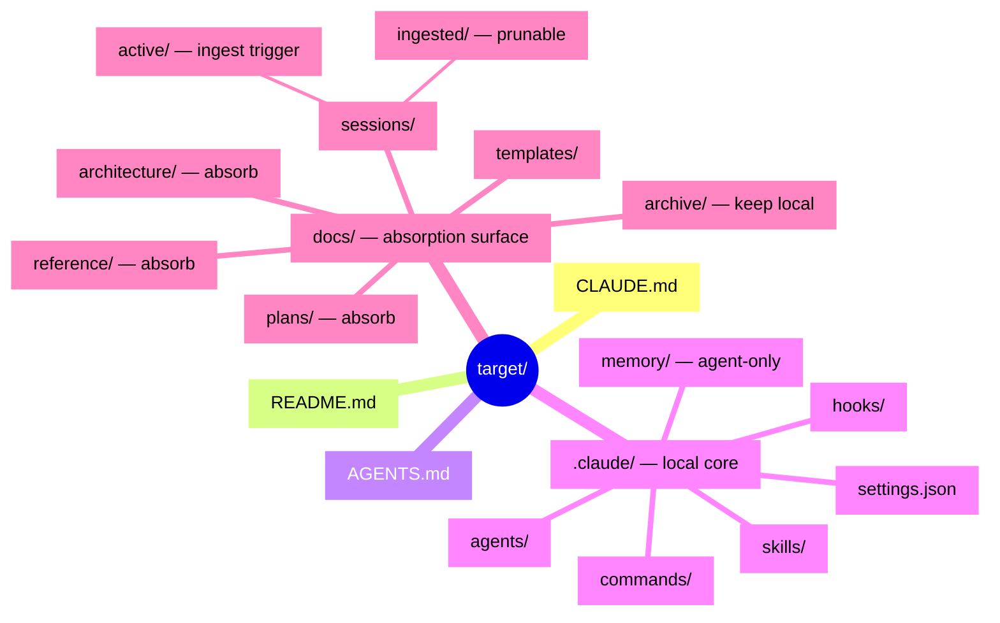

# Target Tree — the canonical structure of a Cortex-managed project

**Created:** 2026-06-08 (Session 18) | **Status:** Exploration — proposal for review | Refs: SPEC §2 (memory model), §3 (layers), LANGUAGE.md (doc-type registry), decision #20
**Grounding:** CE doctrine (`/home/ava/ce/SYSTEM-CONTENTS.md`, `MEMORY-SYSTEM.md`, `CE-SYSTEM-SPEC.md`, `DOC-LANGUAGE.md`), Kaden's sketch (`/home/ava/cortex/Context Schema.md`, `Writing Contract.md`, `Templates/`), this repo as a reference instance, current Claude Code `.claude/` conventions (web-verified 2026-06-08).

## Purpose

A **target** is any project Cortex manages. It should follow ONE optimal, defined tree. That tree is not just a tidiness convention — **it is the first INGEST content for Cortex.** Cortex reads the tree, ingests its documents, and curates them into an engineered MEMORY STORE (a SQL database). Dozens of agents — each owning a purpose, layer, or surface — feed that store.

The store's job is to **replace as much physical project documentation as possible.** The external Cortex system becomes responsible for / containing the documentation. As a managed project progresses, it emits mainly a **session summary** (plus whatever changed under `.claude/`); Cortex ingests that delta and updates the affected documentation in the DB. Over time the target's local `docs/` shrinks toward empty because the canonical copy lives in Cortex.

Critically, the DB + its attributes serve as **PROJECT REFERENCE via MCP.** An agent working in (or on) a target queries Cortex's MCP server to understand the project — instead of reading scattered local files. This is the same move SPEC §3 already proves once: the `ava-docs` 7-tool MCP server (`RUNS`) is the template; a project's own structure becomes a corpus, queried the same way.

### The tree is a gradient, not a snapshot

This is the backbone of the whole proposal. There are really two trees:

| Tree | When | Holds |
|---|---|---|
| **Authoring-time (full)** | Fresh or actively-developed target, before Cortex has absorbed it | `.claude/` + full `docs/` + root `.md` |
| **Steady-state (thin)** | After Cortex's DB has ingested the documentation and serves it via MCP | `.claude/` + irreducible root `.md` + `docs/sessions/` only |

The **session summary is the heartbeat** that moves content full → thin: the target emits a summary, Cortex ingests it, the DB updates, and the now-redundant `docs/` file is removed (its canonical copy is in the store, reachable by MCP). "Remove `docs/` over time" is therefore a concrete pipeline with a defined stopping point, not a vibe. The stopping point is the **irreducible local core** (below).

### The irreducible local core (the floor)

Some files can **never** move to the DB, because they bootstrap the agent *before* MCP is reachable:

- **`CLAUDE.md`** — read at session startup, before any tool or MCP server is available. The kernel.
- **`.claude/` runtime** — `settings.json`, `agents/`, `skills/`, `hooks/`, `commands/`. These *are* the tool runtime; Claude Code reads them as files, not as DB rows.
- **`docs/sessions/active/`** — the write-side delta the DB consumes. The summary must be authored locally before Cortex can ingest it. (The *surface* stays local and irreducible; the summary's *content* is what gets ingested, after which the file moves to `ingested/`.)

Everything else (`docs/architecture/`, `docs/plans/`, `docs/reference/`) is a **DB-absorption candidate.** Identifying this floor is what makes the gradient honest: the thin tree converges to the floor, never below it.

## Proposed Target Tree

The authoring-time (full) tree. The thin tree is this minus the absorbed `docs/` subtrees.

```text
<target>/
├── CLAUDE.md                  # kernel: how agents behave here. NEVER ingested-as-replacement. (human)
├── README.md                  # human entry point (human)
├── AGENTS.md                  # optional: non-Claude agent instructions, if the target uses them (human)
├── .claude/                   # tool runtime — irreducible local core, never DB-replaced
│   ├── settings.json          # permissions, hooks wiring, model (human/agent)
│   ├── settings.local.json    # gitignored personal overrides (human)
│   ├── agents/                # subagent definitions (md + frontmatter) (human/agent)
│   ├── skills/                # reusable workflows (SKILL.md folders) (human/agent)
│   ├── hooks/                 # tool-event scripts (human)
│   ├── commands/              # slash commands (human)
│   └── memory/                # Claude-controlled atomic memory, *.md (AGENT-ONLY)
└── docs/                      # documentation home — the DB-absorption surface
    ├── architecture/          # evergreen structural truth, *.md (human/agent) [absorb]
    ├── plans/                 # active strategic/execution notes, *.md (human/agent) [absorb]
    ├── reference/             # background/vendor/derived reference, *.md (human/agent) [absorb]
    ├── templates/             # note templates agents fill (session summary, etc.) (human)
    ├── sessions/
    │   ├── active/            # one curated session summary per live session (AGENT) [ingest-trigger]
    │   └── ingested/          # summaries Cortex has consumed; safe to prune (AGENT)
    └── archive/               # retired docs with receipts, *.md (human/agent) [keep-local]
```

Notes on the tree:
- **No additional root folders.** Root stays small and doctrinal (CE root-hygiene). Derived/transient material lives inside `.claude/` or `docs/`.
- **`docs/memory/` and `docs/agents/` from the sketch are dropped.** Memory has exactly one home (`.claude/memory/`); agents have exactly one home (`.claude/agents/`). Resolving the sketch's double-homing is a deliberate call (see Open decisions).
- **No `.context/`, no `knowledge.db`.** Per Kaden — prefer direct `.claude/` space; the knowledge store is *Cortex's external DB*, not a per-target file.

### Mermaid view



## Per-node contract

| Path | Purpose | Author | Lifecycle stage | Ingested to DB? |
|---|---|---|---|---|
| `CLAUDE.md` | Agent kernel, read at startup | human | living | No — bootstrap floor (may be *summarized* into DB as reference, never replaced) |
| `README.md` | Human entry point | human | living | Optional (as reference) |
| `AGENTS.md` | Non-Claude agent instructions | human | living | Optional (as reference) |
| `.claude/settings*.json` | Tool permissions, hooks, model | human | living | No — runtime config |
| `.claude/agents/` | Subagent definitions | human/agent | living | No — runtime |
| `.claude/skills/` | Reusable workflows | human/agent | living | No — runtime |
| `.claude/hooks/` | Tool-event scripts | human | living | No — runtime |
| `.claude/commands/` | Slash commands | human | living | No — runtime |
| `.claude/memory/` | Claude-controlled atomic memory | **agent only** | working memory | Mirrored, not replaced — SPEC §2 active/internal memory; the *target-local* exemplar of agent-curated memory |
| `docs/architecture/` | Evergreen structural truth | human/agent | consolidated | **Yes — absorb.** Becomes DB architecture entities; local file removable after ingest |
| `docs/plans/` | Active sequencing, exit criteria | human/agent | active | **Yes — absorb** (status-tracked; DB holds plan state) |
| `docs/reference/` | Background, vendor, derived | human/agent | reference | **Yes — absorb** |
| `docs/templates/` | Note templates agents fill | human | living | No — authoring tool |
| `docs/sessions/active/` | Curated per-session summary | **agent** | capture | **Yes — the ingest trigger.** Each is the delta Cortex reads |
| `docs/sessions/ingested/` | Summaries Cortex has consumed | agent | post-ingest | Already in DB; locally prunable |
| `docs/archive/` | Retired docs + receipts | human/agent | archived | Keep local (audit trail); DB may index |

## What CE says

CE's whole job is helping each project maintain the right local system. Its **Minimal Project System** (`SYSTEM-CONTENTS.md`) is a 7-item checklist; every item has a home in this tree:

| CE requirement | Home in this tree |
|---|---|
| Short agent instruction surface | `CLAUDE.md` (+ `AGENTS.md`) |
| Project overview with current state | `README.md` + `docs/architecture/` |
| A clear docs home | `docs/` |
| Plan/task surface | `docs/plans/` |
| Explicit memory boundaries | `.claude/memory/` (agent) vs `docs/` (curated) vs Cortex DB (canonical) |
| Verification commands | `CLAUDE.md` + per-plan exit criteria |
| Archive rules | `docs/archive/` with receipts |

**Where Cortex agrees with CE:**
- *Root hygiene* — "root stays small and doctrinal; derived material in owned subtrees" (`CE-SYSTEM-SPEC.md`). This directly grounds the decision to add **no new root folders.**
- *Memory precedence* — CE's layer order (project-local truth > workspace doctrine > retrieval memory > dated notes) maps onto Cortex's: target-local files > session summaries > Cortex DB. CE's "state which layer is canonical before making memory claims" becomes a hard tree rule.
- *Repo-first GFM* — `DOC-LANGUAGE.md` prefers standard Markdown links for agent-tool interoperability; matches this repo's LANGUAGE.md surface classes. Targets are repo-first, not vault-first.

**Where Cortex diverges from CE:**
- CE keeps the **canonical human-readable truth local** (its own `/home/ava/ce` workspace is the authority). Cortex deliberately **inverts** this for managed targets: the canonical documentation migrates *out* to the external DB, and the local tree thins toward the floor. CE curates-in-place; Cortex curates-and-evacuates. (This is the gradient — CE has no equivalent because CE is itself the store, whereas a Cortex target is fed *by* a separate store.)
- CE's retrieval memory is per-agent LanceDB; Cortex's is one shared SQL store served by MCP to many agents and many targets.

## Open decisions

1. **Additional root folders — y/n?** *Recommendation: NO.* `.claude/` + `docs/` + root `.md` is sufficient. CE root-hygiene + Kaden's lean both point here. Revisit only if a target needs a build/output surface that genuinely is neither runtime nor docs.
2. **`docs/` removal path.** *Recommendation:* absorb-then-remove, gated on ingest confirmation. A `docs/` file is removed only after Cortex confirms its content is in the DB and MCP-queryable. Floor = the irreducible local core; `docs/sessions/` and `docs/archive/` persist. Open: does removal happen automatically (Cortex agent prunes) or via a human-gated step?
3. **`sessions/` model — active vs ingested.** *Recommendation:* keep the two-bucket model from the sketch but rename for clarity: `active/` = not-yet-consumed deltas; `ingested/` = consumed, prunable. The ingest pipeline moves files `active/ → ingested/` on successful DB write. Open: retention policy on `ingested/` (delete immediately, or keep N).
4. **`.claude/` project-vs-global enforcement.** Known constraint: Claude Code *sometimes* prefers the global `~/.claude/` over the project `.claude/` (Kaden's observed behavior). *Accepted mitigation (Kaden):* a single firm rule in `CLAUDE.md` — **"use ONLY the project `.claude/`; never the global `~/.claude/` for this target."** This is a documented operator rule, not a technical fix. (Docs claim project-precedence-over-global; the rule exists precisely because lived behavior doesn't always honor that — trust the operator's primary-source experience here.)
5. **What stays as files vs moves to DB.** Resolved by the irreducible-core line: runtime (`.claude/`) + kernel (`CLAUDE.md`) + the session-summary write surface stay as files; all `docs/` knowledge subtrees are absorption candidates. Open: granularity of absorption (whole file vs section — see Mapping to ingest).
6. **Sketch contradictions resolved.** The sketch double-homed `memory/` (`.claude/memory/` *and* `docs/memory/`) and `sessions/` (`docs/sessions/` *and* `.claude/sessions/archive`). *Resolution:* one home each — Claude-controlled atomic memory → `.claude/memory/`; session summaries → `docs/sessions/`. `docs/memory/dreaming` (scheduled dream output) is **out of scope for the target tree** — that is Cortex-internal (Hippocampus, SPEC §3), not a managed-target concern.

> Scope note: the orchestration-convergence question (PydanticAI vs Agent SDK; whether `agent-pipeline/` becomes `cortex/`) is **gated** (`exploration/ecosystem-correlation.md`). The target tree is file/folder structure for *managed projects* — orthogonal to that gate. This doc takes no position on it.

## Mapping to ingest

How the tree feeds Cortex's ingest layer → SQL memory store → MCP project-reference:

1. **Ingest unit = the document section (heading-anchored), with the file as the grouping parent.** This mirrors the proven corpus pipeline exactly (SPEC §4 Tier 1: Source → Page → Section → Chunk). A target maps cleanly: **target = Source; `docs/` file = Page; heading section = Section.** Sections (not whole files) are the unit because MCP project-reference queries want "the invariants of subsystem X," not "the whole architecture doc." This reuses the existing `doc_sections` model rather than inventing one.
2. **Frontmatter is the type signal.** Per `Writing Contract.md` + LANGUAGE.md doc-type registry, each note declares `type`/`status`/`layer`/`updated`/`source_of_truth`. The ingest parser routes on `type` (architecture/plan/reference/session) into the corresponding DB entities. This is the per-doc-type frontmatter contract LANGUAGE.md flags as an open question — the target tree gives it a concrete consumer.
3. **The session summary is the write event.** A `docs/sessions/active/<id>.md` (Writing Contract sections: Scope / Changed Surfaces / Decisions / Durable Facts / Follow-up / Promotion Candidates) is the delta Cortex ingests each cycle. "Durable Facts" and "Promotion Candidates" are the explicit hooks that tell Cortex what to fold into long-term entities — the same capture → working → long-term promotion SPEC §2 describes, now driven by a structured doc.
4. **MCP serves it back.** Once ingested, an agent understands a target by calling Cortex's MCP tools (the `ava-docs` 7-tool shape: search / get_section / resolve_symbol / list_sources …) against that target's Source — not by reading the (now-thinned) local `docs/`. This is what lets `docs/` be removed: the read path moved to MCP.

**Net:** the tree is engineered so that authoring (humans + agents writing GFM + frontmatter into `docs/`) and ingestion (Cortex parsing section-by-section into SQL) are two ends of one pipe. Author once, in files; Cortex derives the queryable store; the files then evacuate — exactly the "humans author once, machines derive the rest" rule (LANGUAGE.md), applied at the scale of a whole project.

## Confidence / provenance

- **Grounded:** the absorption gradient (SPEC §2 promotion lifecycle), the ingest unit = section (SPEC §4 Tier 1 corpus model, `RUNS`), CE's 7-item minimal system + root hygiene, the `.claude/` runtime contents (web-verified), Kaden's lean + global-vs-project mitigation.
- **Opinion / proposal (flag as such):** the two-bucket `active/ → ingested/` flow, dropping `docs/memory|agents/`, section-granularity over file-granularity, and the auto-vs-gated removal question are recommendations, not yet decisions. Promote via `DECISIONS.md` when a target is first onboarded (the natural trigger).
