# Mermaid — Expert Reference (Cortex design phase)

> Verified against [mermaid.js.org](https://mermaid.js.org/) and the [mermaid-js/mermaid](https://github.com/mermaid-js/mermaid) repo, 2026-06-08. Mermaid adds diagram types often — re-verify beta items against current docs.

## Mermaid — at a glance (version, how it renders)

- **Current release: `11.15.0`** (2026-05; v10 still backported, latest `10.9.6`). Major line is **v11**. Source: [GitHub releases](https://github.com/mermaid-js/mermaid/releases).
- Mermaid is a **client-side JS renderer**: it parses a text definition and emits **SVG** in the browser. There is no server render step — the host (GitHub, Obsidian, VS Code preview) bundles a Mermaid version and calls `mermaid.run()`/`mermaid.render()` on fenced ```` ```mermaid ```` blocks.
- **Consequence that matters for Cortex:** what renders depends on the *host's bundled Mermaid version*, not the latest release. Newer/beta diagram types may not render on an older host. Check a host's version by putting `info` inside a mermaid block (renders a version badge). Stable core types (flowchart, sequence, class, state, er, gantt, pie) render everywhere; treat everything newer as "verify on target."

## Diagram type catalog

`info` is the canonical version probe, not a diagram. "Beta" below = keyword carries `-beta` and/or 🔥 (recent) / 🦺⚠️ (caution) in the [intro list](https://mermaid.js.org/intro/). Minimal syntax inline only for stable types verified by hand; newer types reference their [syntax doc](https://mermaid.js.org/intro/syntax-reference.html).

| Type | Purpose | Status | Min example / ref |
|---|---|---|---|
| flowchart | Nodes + edges; general logic/flow | **stable** | `flowchart LR` then `A[Start] --> B{Cond} -->|yes| C` |
| sequenceDiagram | Actor message exchange over time | **stable** | `sequenceDiagram` then `A->>B: req` / `B-->>A: resp` |
| classDiagram | UML classes, members, relations | **stable** | `classDiagram` then `Animal <|-- Dog` |
| stateDiagram-v2 | State machine / lifecycle transitions | **stable** | `stateDiagram-v2` then `[*] --> Idle --> Done --> [*]` |
| erDiagram | Entities + relationships (cardinality) | **stable** (docs label "experimental") | `erDiagram` then `USER ||--o{ ORDER : places` |
| journey | User-journey satisfaction steps | stable | `journey` then `title T` / `section S` / `Task: 5: Me` |
| gantt | Project schedule / timeline bars | stable | `gantt` then `dateFormat YYYY-MM-DD` / `task :a1, 2026-01-01, 7d` |
| pie | Proportion pie chart | stable | `pie title T` then `"A" : 40` |
| quadrantChart | 2-axis scatter into 4 quadrants | stable | [quadrantchart](https://mermaid.js.org/syntax/quadrantChart.html) |
| requirementDiagram | Requirements + verification links | stable | [requirements](https://mermaid.js.org/syntax/requirementDiagram.html) |
| gitGraph | Git branch/commit history | stable | [gitgraph](https://mermaid.js.org/syntax/gitgraph.html) |
| C4 (`C4Context` etc.) | C4 model architecture views | 🦺⚠️ caution | [c4](https://mermaid.js.org/syntax/c4.html) |
| mindmap | Hierarchical idea map | stable | `mindmap` then indented `root((X))` / children |
| timeline | Chronological events | stable | `timeline` then `title T` / `2026 : event` |
| zenuml | Alt sequence-diagram syntax | 🔥 (keyword `zenuml`, no `-beta`) | [zenuml](https://mermaid.js.org/syntax/zenuml.html) |
| sankey | Weighted flow / Sankey | 🔥 (keyword **`sankey`** — `-beta` dropped) | [sankey](https://mermaid.js.org/syntax/sankey.html) |
| xychart | Bar/line XY chart | 🔥 (keyword **`xychart`** — `-beta` dropped) | [xychart](https://mermaid.js.org/syntax/xyChart.html) |
| block | Free-form block layout / grids | 🔥 (keyword **`block`** — `-beta` dropped) | [block](https://mermaid.js.org/syntax/block.html) |
| packet | Network packet byte layout | 🔥 (keyword **`packet`** — `-beta` dropped) | [packet](https://mermaid.js.org/syntax/packet.html) |
| kanban | Kanban board | 🔥 (keyword `kanban`, no `-beta`) | [kanban](https://mermaid.js.org/syntax/kanban.html) |
| architecture-beta | Cloud/CI service+group topology | 🔥 (feature stable since 11.1.0, **keyword still `architecture-beta`**) | `architecture-beta` / `group api(cloud)[API]` / `service db(database)[DB] in api` / `db:R --> L:server` |
| radar-beta | Radar / spider chart | 🔥 beta | [radar](https://mermaid.js.org/syntax/radar.html) |
| treemap-beta | Nested rectangle treemap | 🔥 beta | [treemap](https://mermaid.js.org/syntax/treemap.html) |
| Newer cluster: `eventmodeling`, `venn-beta`, `ishikawa-beta`, `wardley-beta`, `treeView-beta` | Specialty (event-sourcing, set overlap, fishbone, Wardley map, tree) | 🔥 newest (11.13–11.15) | [syntax reference](https://mermaid.js.org/intro/syntax-reference.html) |

## Per-type syntax

One subsection per type: header keyword, core constructs, and a compact example. Stable core (flowchart…pie) renders everywhere; beta/🔥 types carry a version-pin caveat (see rendering matrix). Keywords verified against the official syntax pages (raw repo source) on 2026-06-08; every example below was render-validated on Mermaid 11.x **except zenuml** (the validator host doesn't load that external diagram — see its note).

### flowchart — [docs](https://mermaid.js.org/syntax/flowchart.html)
Header `flowchart <dir>`; dirs `TB`/`TD`/`BT`/`RL`/`LR`. Nodes: `id[rect]`, `(round)`, `([stadium])`, `[[subroutine]]`, `[(cylinder)]`, `((circle))`, `{rhombus}`, `{{hexagon}}`. v11 expanded shapes: `A@{ shape: rect }` (also `diam`, `cyl`, `stadium`, `hex`, `cloud`, `doc`…). Edges: `-->` arrow, `---` open, `-.->` dotted, `==>` thick, `--x`/`--o`, label `-->|text|` or `A-- text -->B`. `subgraph id ["Title"] … end`; `classDef name fill:#f9f;` + `class id name` (or `id:::name`). `linkStyle 0 stroke:red`.
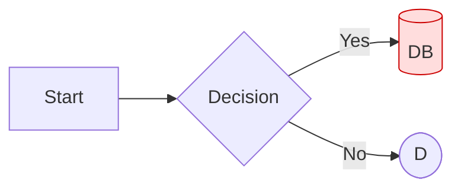

### sequenceDiagram — [docs](https://mermaid.js.org/syntax/sequenceDiagram.html)
Header `sequenceDiagram`. Declare `participant A` or `actor B` (alias `participant A as Alice`). Messages: `->>` solid arrow, `-->>` dashed reply, `-x`/`--x` lost, `-)`/`--)` async, `<<->>` bidirectional. Activation: `activate`/`deactivate` or `+`/`-` on arrows. `Note left of/right of/over A,B: text`. Blocks: `loop`, `alt`/`else`, `opt`, `par`/`and`, `critical`, `break`. `autonumber` numbers messages.
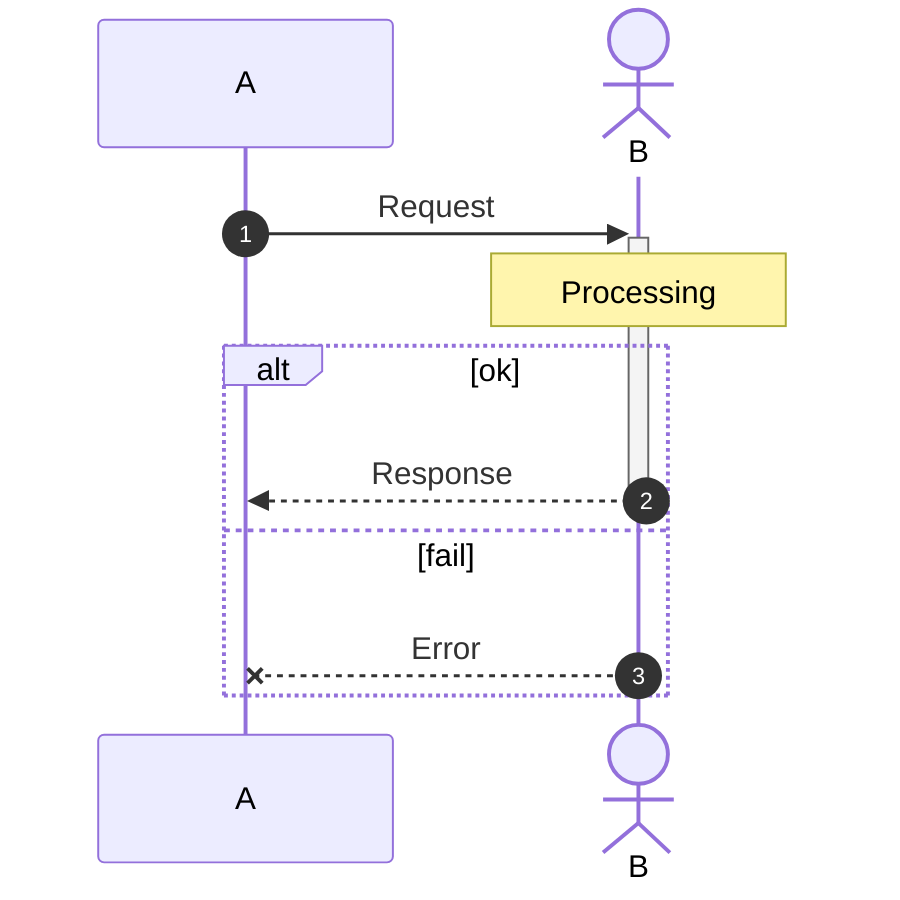

### classDiagram — [docs](https://mermaid.js.org/syntax/classDiagram.html)
Header `classDiagram`. Class: `class Name { +int age \n +run() }` or per-line `Name : +attr`. Visibility `+` public, `-` private, `#` protected, `~` package. Relations: `<|--` inheritance, `*--` composition, `o--` aggregation, `-->` association, `..>` dependency, `..|>` realization. Generics with tildes `List~int~`. Annotations `<<interface>>`, `<<abstract>>`, `<<enumeration>>`.
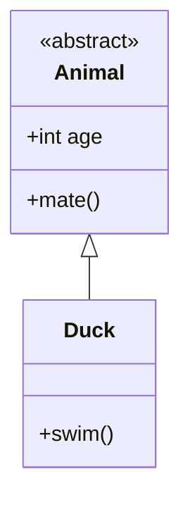

### stateDiagram-v2 — [docs](https://mermaid.js.org/syntax/stateDiagram.html)
Header `stateDiagram-v2`. `[*]` is start/end. Transition `A --> B : label`; description `A : text`. Composite: `state Outer { [*] --> Inner }`. Choice/fork/join via `state x <<choice>>` / `<<fork>>` / `<<join>>`. `note right of A : text`.
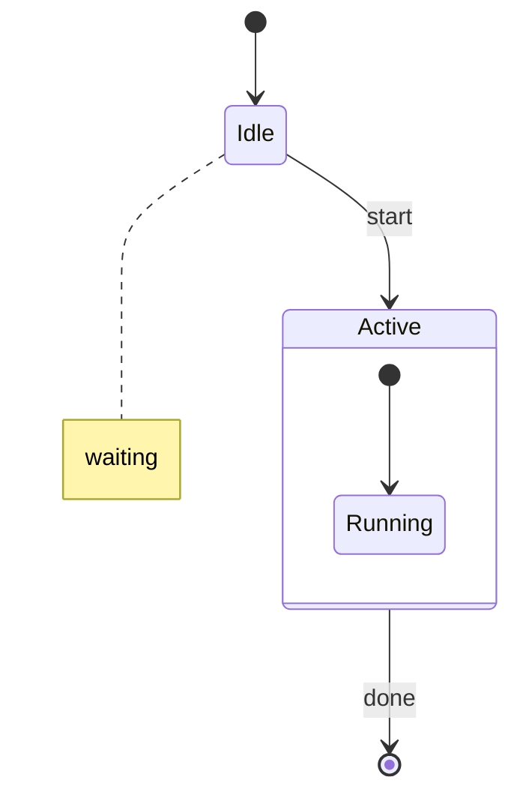

### erDiagram — [docs](https://mermaid.js.org/syntax/entityRelationshipDiagram.html)
Header `erDiagram`. Relationship `A <card>--<card> B : label`. Cardinality (crow's foot): `||` exactly one, `|o`/`o|` zero-or-one, `}|`/`|{` one-or-more, `}o`/`o{` zero-or-more. Line: `--` identifying (solid), `..` non-identifying (dashed). Attribute block `ENTITY { type name PK }` — keys `PK`/`FK`/`UK`.
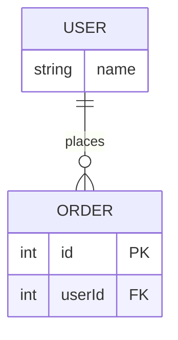

### journey — [docs](https://mermaid.js.org/syntax/userJourney.html)
Header `journey`. `title T`, `section Name`, then `Task name: <score 1-5>: Actor1, Actor2`.
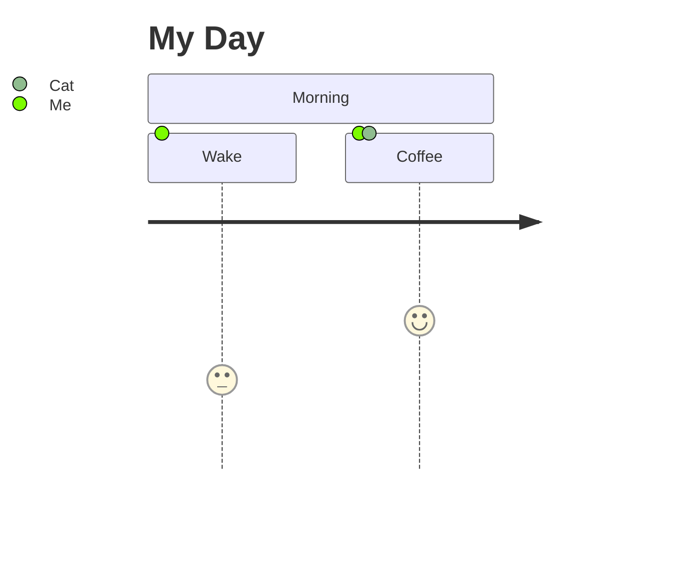

### gantt — [docs](https://mermaid.js.org/syntax/gantt.html)
Header `gantt`. `dateFormat YYYY-MM-DD` (input), `axisFormat %m-%d` (axis). `section Name`. Task `Title :[tags,] id, start, end|dur`; tags `done`/`active`/`crit`/`milestone`. Dependency `after id`.
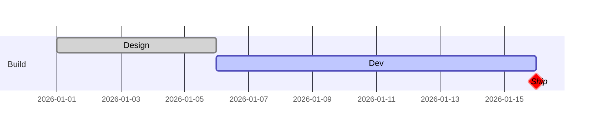

### pie — [docs](https://mermaid.js.org/syntax/pie.html)
Header `pie` (optional `showData`), `title T`, then `"label" : value`.
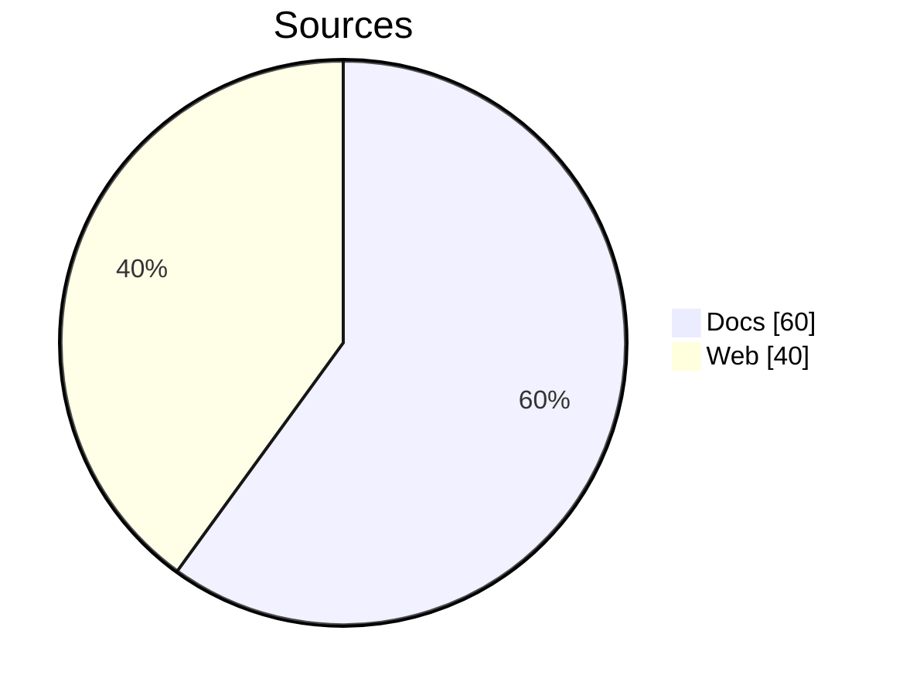

### quadrantChart — [docs](https://mermaid.js.org/syntax/quadrantChart.html)
Header `quadrantChart`. `x-axis Low --> High`, `y-axis Low --> High`, `quadrant-1..4 Label` (1=top-right, ccw). Point `Name: [x, y]` with x,y in 0–1.
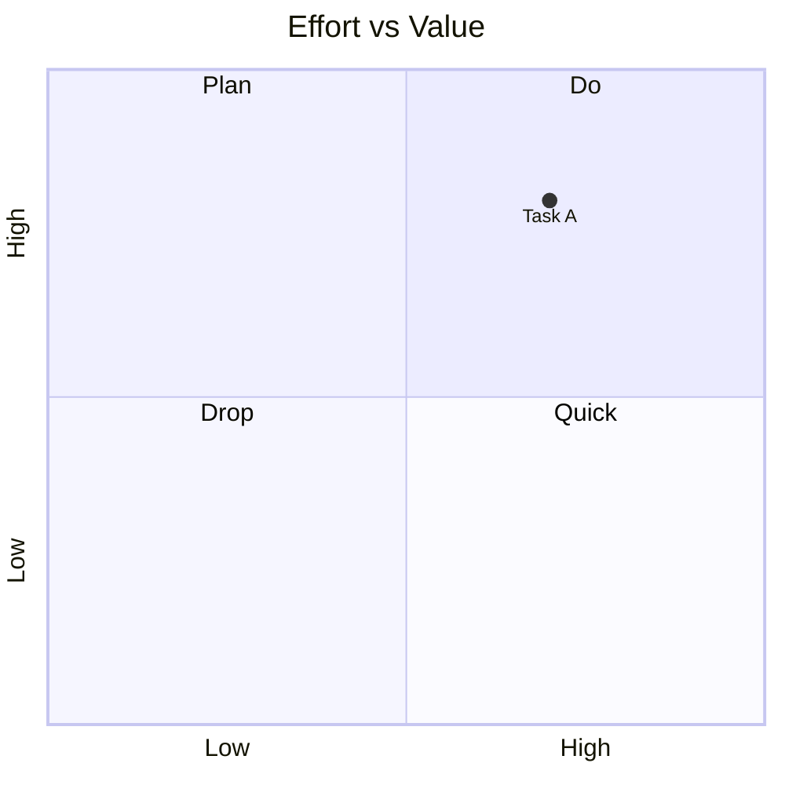

### requirementDiagram — [docs](https://mermaid.js.org/syntax/requirementDiagram.html)
Header `requirementDiagram`. Types: `requirement`, `functionalRequirement`, `performanceRequirement`, `interfaceRequirement`, `physicalRequirement`, `designConstraint`. Body: `id`, `text`, `risk` (Low/Medium/High), `verifymethod` (Analysis/Inspection/Test/Demonstration). `element name { type: …; docref: … }`. Relations: `satisfies`, `contains`, `derives`, `refines`, `traces`, `copies`, `verifies`.
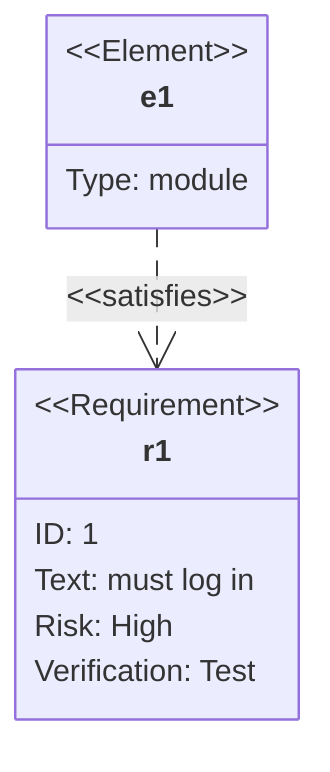

### gitGraph — [docs](https://mermaid.js.org/syntax/gitgraph.html)
Header `gitGraph` (camelCase; orientation `gitGraph LR:` / `TB:`). `commit id:"x" tag:"v1" type:HIGHLIGHT|REVERSE|NORMAL`; `branch dev`; `checkout main` (alias `switch`); `merge dev`; `cherry-pick id:"x"`.
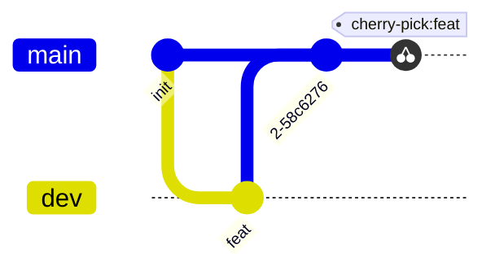

### C4 — [docs](https://mermaid.js.org/syntax/c4.html) (⚠️ experimental)
Headers `C4Context`, `C4Container`, `C4Component`, `C4Dynamic`, `C4Deployment`. Elements: `Person(alias,label,?descr)`, `System(...)`, `Container(...)`, `Component(...)`. Grouping `Boundary(alias,label){ … }` (also `System_Boundary`, `Enterprise_Boundary`). `Rel(from,to,label,?tech)` (+ directional `Rel_D/U/L/R`).
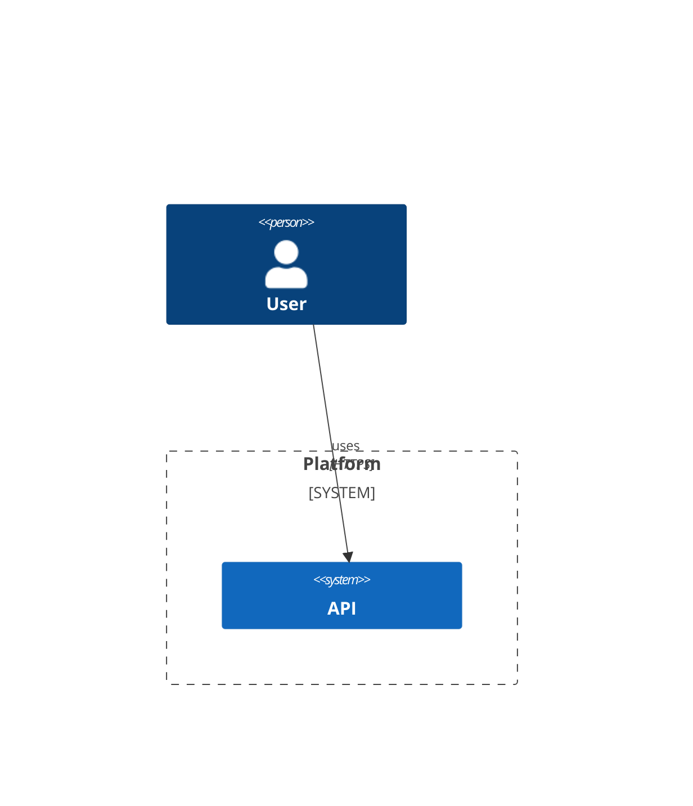

### mindmap — [docs](https://mermaid.js.org/syntax/mindmap.html)
Header `mindmap`. Hierarchy by indentation. Root shape `root((circle))`; node shapes `[square]`, `(rounded)`, `((circle))`, `))bang((`, `)cloud(`, `{{hexagon}}`. Icons `::icon(fa fa-book)`; class `:::className`.
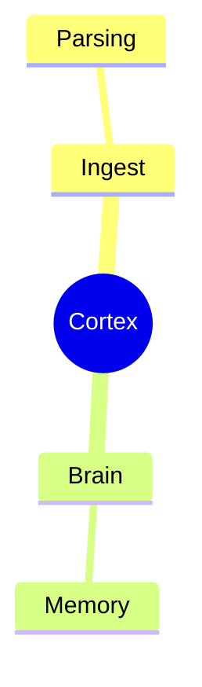

### timeline — [docs](https://mermaid.js.org/syntax/timeline.html)
Header `timeline`. `title T`, optional `section Name`, then `period : event : event` (extra colons add events).
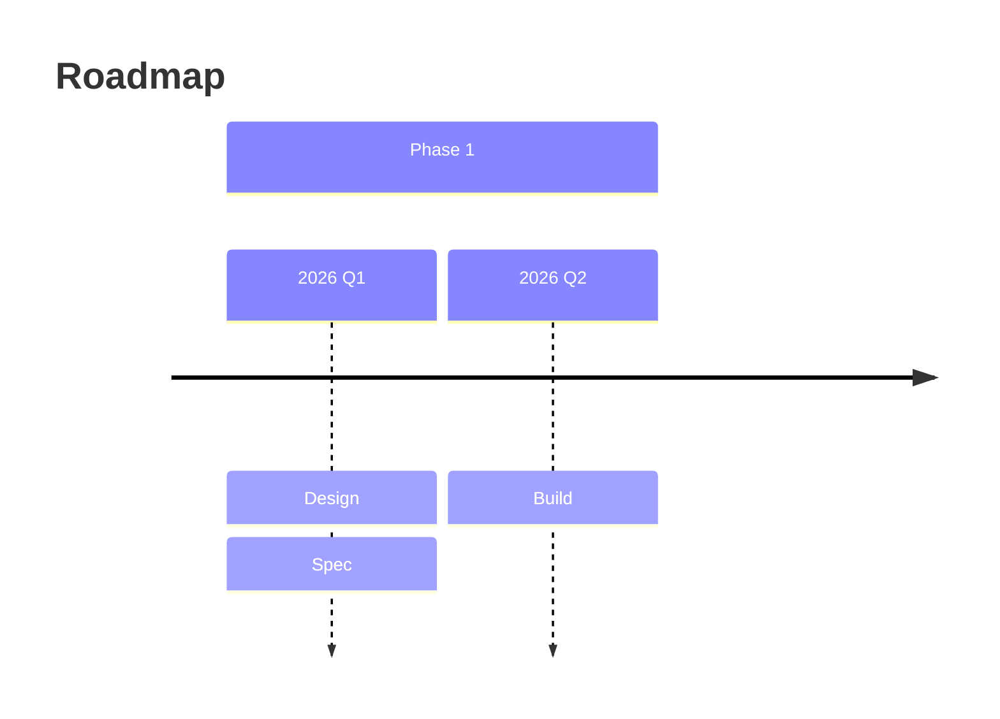

### zenuml — [docs](https://mermaid.js.org/syntax/zenuml.html) (🔥 lazy-loaded)
Header `zenuml`. Participants implicit or `@Actor A`. Sync `A->B.method()`, nested via braces; async `A->B: msg`; reply `return x` or `@return`. Separate parser from `sequenceDiagram`. **Caveat:** zenuml is a lazy-loaded external diagram — it won't render where the host hasn't bundled it (GitHub/Obsidian/some validators show "no diagram type detected"). Confirm on the target host; the example below reflects doc syntax but was not render-verified here.
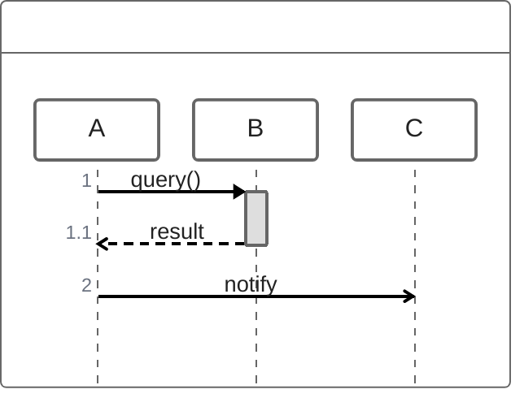

### sankey — [docs](https://mermaid.js.org/syntax/sankey.html) (🔥 keyword `sankey`, was `sankey-beta`)
Header `sankey`, then CSV rows `source,target,value`. Quote labels containing commas.
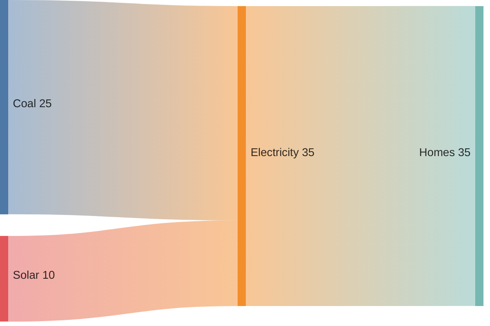

### xychart — [docs](https://mermaid.js.org/syntax/xyChart.html) (🔥 keyword `xychart`, was `xychart-beta`)
Header `xychart` (add `horizontal` to rotate). `title "T"`. `x-axis [cat1, cat2]` or `x-axis t min --> max`. `y-axis "T" min --> max`. Series `bar [..]`, `line [..]`.
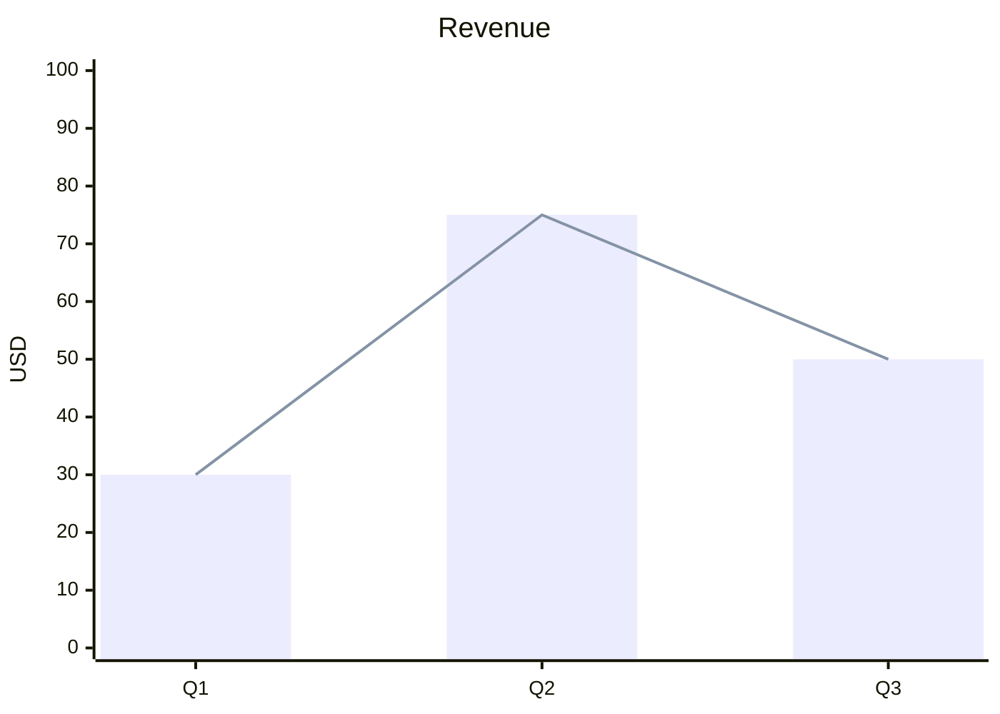

### packet — [docs](https://mermaid.js.org/syntax/packet.html) (🔥 keyword `packet`, was `packet-beta`)
Header `packet`. Rows `start-end: "Label"` (or single `n: "x"`, or `+count: "x"`); bits are 0-indexed.
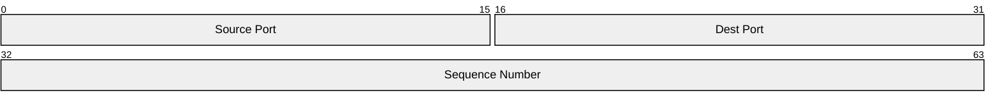

### block — [docs](https://mermaid.js.org/syntax/block.html) (🔥 keyword `block`, was `block-beta`)
Header `block`. `columns N` sets width. Blocks `a`, `A["label"]`; span columns `b[2]`; `space`/`space:N` for gaps. Edges `A --> B`, labels `A -->|t| B`. Shapes/styles reuse flowchart syntax.
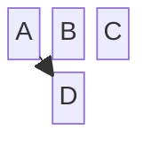

### kanban — [docs](https://mermaid.js.org/syntax/kanban.html) (🔥)
Header `kanban`. Columns `colId[Title]`; cards indented `taskId[Text]`; metadata `@{ assigned: "x", priority: "High", ticket: "T-1" }`.
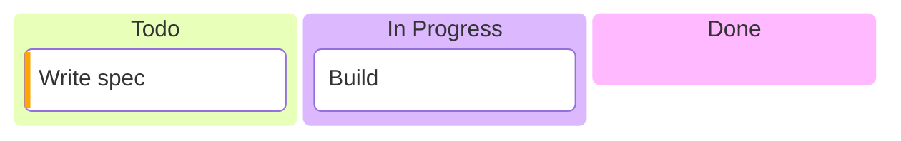

### architecture-beta — [docs](https://mermaid.js.org/syntax/architecture.html) (🔥 feature-stable since 11.1.0; keyword keeps `-beta`)
Header `architecture-beta`. `group id(icon)[Title]`; `service id(icon)[Title] in parent`; `junction id`. Edge `aId:R --> L:bId` (sides T/B/L/R; arrows `<`/`>`; cross-group `aId{group}:R --> ...`).
```mermaid
architecture-beta
  group api(cloud)[API]
  service db(database)[DB] in api
  service srv(server)[Server] in api
  db:R --> L:srv
```

### radar-beta — [docs](https://mermaid.js.org/syntax/radar.html) (🔥)
Header `radar-beta`. `title T`; `axis a["A"], b["B"], c["C"]`; `curve id["Label"]{v1,v2,v3}` (values map to axis order).
```mermaid
radar-beta
  title Skills
  axis a["Speed"], b["Power"], c["Range"]
  curve hero["Hero"]{80, 60, 90}
```

### treemap-beta — [docs](https://mermaid.js.org/syntax/treemap.html) (🔥)
Header `treemap-beta`. Section `"Name"`; leaf with value `"Name": 12`; nesting by indentation.
```mermaid
treemap-beta
"Repo"
    "src": 120
    "docs": 40
"tests": 30
```

### eventmodeling — [docs](https://mermaid.js.org/syntax/eventmodeling.html) (🔥 newest)
Header `eventmodeling`. Models information change over time as swimlanes of triggers / commands / views / events. Syntax still evolving — verify on target host.

### Newest specialty cluster (verify keyword + render on target host)
Brief, syntax evolving; cite docs and validate before committing.
- `venn-beta` — set-overlap Venn — [docs](https://mermaid.js.org/syntax/venn.html)
- `ishikawa-beta` — fishbone / cause-effect — [docs](https://mermaid.js.org/syntax/ishikawa.html)
- `wardley-beta` — Wardley strategy map — [docs](https://mermaid.js.org/syntax/wardley.html)
- `treeView-beta` — directory-style tree — [docs](https://mermaid.js.org/syntax/treeView.html)

## Shared syntax

Cross-cutting constructs usable inside (most) diagram types.
- **Comments:** lines starting with `%%` are ignored. `%% this is a comment`
- **Frontmatter config** (preferred; renders on GitHub) — a `---`-fenced YAML block at the *top of the diagram*:
  ```
  ---
  title: My Diagram
  config:
    theme: forest
    flowchart: { curve: linear }
  ---
  flowchart LR
    A --> B
  ```
- **`%%{init}%%` directive** (inline, legacy): `%%{init: {'theme':'base','themeVariables':{'primaryColor':'#fff'}}}%%` on the line before the header.
- **Styling / classDef:** `classDef name fill:#f9f,stroke:#333;` then `class id name` or `id:::name` (flowchart/state/class). `style id fill:#bbf` targets one node. Commas inside style values escape as `\,`.
- **Escaping / entities:** quote labels with hard chars `A["text (parens), :colon"]`. Inside quotes use HTML entities — `#quot;` = `"`, `#35;` = `#`, `#lt;`/`#gt;` = `<`/`>` (numeric codes are base-10).
- **Markdown strings in labels:** backtick-inside-quote enables markdown — `A["`**bold** and _italic_`"]`; supports `<br>` / newline wrapping.

## Rendering support (GitHub / Obsidian / VS Code / Live Editor / CLI)

| Host | How | Notes / version caveat |
|---|---|---|
| **GitHub** | Fenced ```` ```mermaid ```` in `.md`, issues, PRs, discussions, wikis | Renders server-side-pinned Mermaid. **No published version number** — probe with an `info` block. Stable core types render. Newer beta types may lag the pinned version — verify before relying. **Unsupported regardless:** click/hyperlinks, tooltips, callbacks, `fa:` icons, many emoji/extended-ASCII in labels break parsing. [GitHub docs](https://docs.github.com/en/get-started/writing-on-github/working-with-advanced-formatting/creating-diagrams), [GitHub blog](https://github.blog/developer-skills/github/include-diagrams-markdown-files-mermaid/) |
| **Obsidian** | Native in code blocks (Live Preview + Reading) | Bundles its own Mermaid; tracks fairly current in 2026 but lags releases. Core + mindmap/timeline/journey/gantt render; **verify newest beta types on your installed Obsidian version**. [Obsidian forum](https://forum.obsidian.md/t/is-there-a-list-of-supported-mermaid-diagram-types-anywhere/62721) |
| **VS Code** | Preview extension | Built-in MD preview: **`bierner.markdown-mermaid`** (a.k.a. mjbvz; Mermaid ~11.12 as of 2026). Official **`MermaidChart.vscode-mermaid-chart`** (Mermaid team, syntax highlight, pan/zoom, SVG/PNG export, AI). [marketplace](https://marketplace.visualstudio.com/items?itemName=bierner.markdown-mermaid) |
| **Live Editor** | [mermaid.live](https://mermaid.live) | Always latest-ish; best place to validate syntax + get shareable links / SVG-PNG export |
| **CLI** | `@mermaid-js/mermaid-cli`, command **`mmdc`** | `mmdc -i in.mmd -o out.svg` (also `.png`, `.pdf`). v `11.15.0`. Use for generated/data-dense views per CLAUDE.md. [mermaid-cli](https://github.com/mermaid-js/mermaid-cli) |

## Config, theming, accessibility

**Frontmatter config (preferred, portable, renders on GitHub):** a YAML block at the *top of the diagram*, not the file.

```
---
title: My Diagram
config:
  theme: forest
  flowchart:
    curve: linear
---
flowchart LR
  A --> B
```

**`%%{init}%%` directive (inline, legacy but works):**
```
%%{init: {'theme':'base', 'themeVariables':{'primaryColor':'#fff'}}}%%
flowchart LR
  A --> B
```

- **Built-in themes:** `default`, `neutral`, `dark`, `forest`, `base`. Only **`base`** is customizable via `themeVariables`. [theming docs](https://mermaid.js.org/config/theming.html)
- Diagram-level config goes under a per-type key (`flowchart:`, `sequence:`, `er:`, …) in the `config:` block.
- **Accessibility** ([docs](https://mermaid.js.org/config/accessibility.html)) — add inside any diagram: `accTitle: short title`, single-line `accDescr: text`, or multiline:
  ```
  accDescr {
    Line one.
    Line two.
  }
  ```
  Emits SVG `<title>`/`<desc>`. Cheap; add to every committed diagram.

## Gotchas

- **`end` is reserved in flowcharts** — a lowercase node named `end` breaks the diagram. Use `End`/`END` or an id alias. ([flowchart docs](https://mermaid.js.org/syntax/flowchart.html))
- **Special chars in labels → quote them:** `A["Text with (parens), :colon, #hash"]`. Inside quotes, encode hard chars as HTML entities — `#quot;` for `"`, `#35;` for `#` (numbers are base-10). Markdown labels use `["`backtick text`"]`.
- **Commas in style values** (e.g. `stroke-dasharray`) must be escaped as `\,`.
- **Emoji / extended-ASCII** in labels frequently break parsing on GitHub specifically.
- **`subgraph` quirks:** give subgraphs an explicit id + quoted title (`subgraph id ["Title"]`); edges may cross subgraph boundaries but direction can fight the parent `direction`. Keep node ids unique across subgraphs.
- **How it fails:** Mermaid does **not** fail silently — an invalid block renders a visible **error box** (red "Syntax error in text" / parse message) in place of the diagram, on GitHub and in the Live Editor alike. Validate at [mermaid.live](https://mermaid.live) before committing.
- **Version drift is the silent failure mode:** a brand-new diagram type renders locally (latest Mermaid) but shows an error box on GitHub (older pinned). Probe with `info`; prefer stable types for committed `.md`.

## Cortex usage guide (the types we adopt)

Cortex commits hand-authored diagrams into `.md` files that must render in **GitHub + Obsidian with zero infra** (decision #20). That constraint favors the **stable core**, which renders on every host. Recommended set:

1. **`flowchart`** — primary workhorse. Layer architecture (ingest → brain → orchestration) via `subgraph` per layer; agent pipelines and orchestration fan-out/synthesis flows. Portable everywhere. Use this for layer/architecture views *instead of* `architecture-beta`/`block-beta` until those are confirmed on our GitHub pin.
2. **`erDiagram`** — the entity catalog (SPEC §4 entities + relationships/cardinality). Direct fit for the brain's data model.
3. **`sequenceDiagram`** — multi-agent message exchange and orchestration timelines (main loop ↔ subagents ↔ DAL/services).
4. **`stateDiagram-v2`** — memory consolidation lifecycle and document lifecycle (`exploration/` → `plans/` → `architecture/`); status-tag transitions.
5. **`classDiagram`** *(optional 5th)* — only if we need typed structure/interfaces for an entity beyond what `erDiagram` expresses.

**Defer for Cortex:** `architecture-beta`, `block-beta`, `radar-beta`, `treemap-beta`, etc. — attractive for cloud-topology/layer views but beta + version-pin risk on GitHub. If a data-dense or generated view needs them, render via `mmdc` to committed SVG (CLAUDE.md generated-view path), don't rely on inline GitHub rendering. Always add `accTitle`/`accDescr` and validate on mermaid.live before commit.
